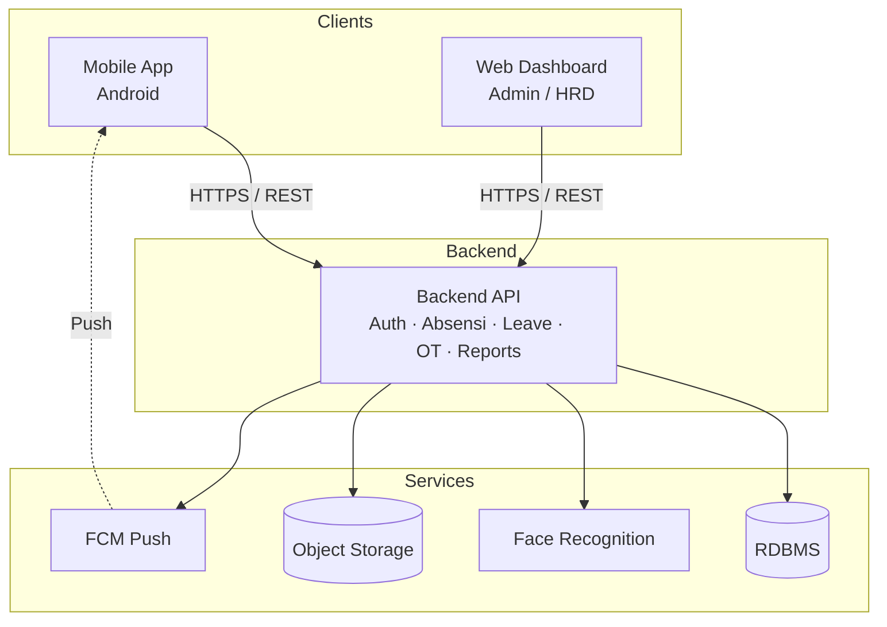
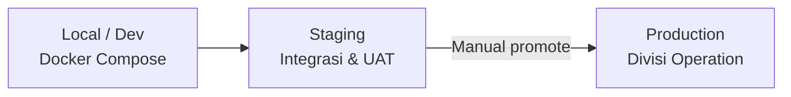
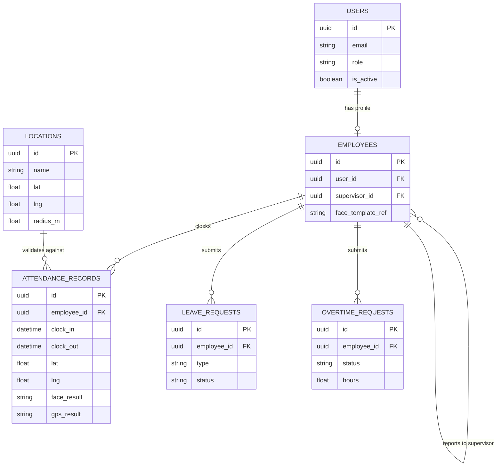
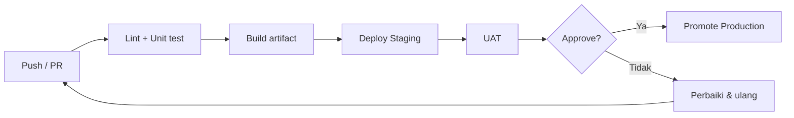
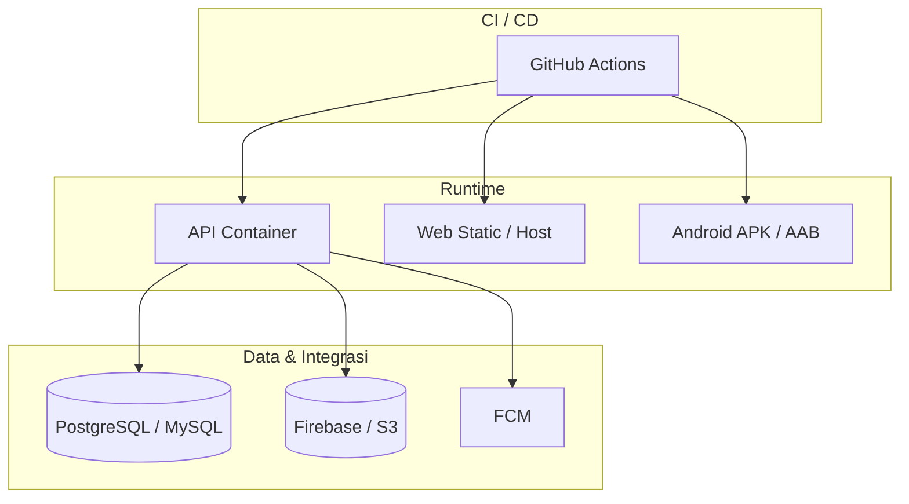

# Infrastructure Document

:::info Status
**Draft** — disusun dari Proposal Capstone Project Kelompok B (STSI4440, 2026). Keputusan stack final (Node vs Python, Flutter vs RN, dsb.) masih terbuka sesuai tabel teknologi di proposal.
:::

| Field | Value |
|-------|-------|
| Product | Nexus Ops — Aplikasi Absensi Divisi Operation |
| Version | 0.1.0 (Draft) |
| Tim | Kelompok B — Capstone Project 50 Team B 2026 |
| Last updated | 2026-09-22 |

---

## 1. Tujuan dokumen

Dokumen ini mendeskripsikan **arsitektur infrastruktur draft** untuk Nexus Ops: komponen sistem, lingkungan (dev/staging/prod), penyimpanan data, keamanan, observabilitas, dan rencana deployment. Detail final akan dikunci pada fase System Design (Minggu 2).

Dokumen terkait: [Product Requirements Document (PRD)](./prd)

---

## 2. Ringkasan arsitektur

Sistem terdiri dari tiga permukaan klien + backend API + layanan pendukung:

| Lapisan | Komponen | Teknologi kandidat (dari proposal) |
|---------|----------|-------------------------------------|
| Mobile | Aplikasi absensi karyawan (Android) | Flutter **atau** React Native |
| Web | Dashboard admin / supervisor / HRD | React.js **atau** Vue.js |
| API | RESTful backend | Node.js (Express) **atau** Python (FastAPI) |
| Data | Relational DB | PostgreSQL **atau** MySQL |
| AI/CV | Face recognition service | face-api.js **atau** Python `face_recognition` |
| Lokasi | GPS + geofencing | Geolocation API (device) + validasi server |
| Storage | Objek (foto enroll / bukti absensi) | Firebase Storage **atau** AWS S3 |
| Push | Notifikasi | Firebase Cloud Messaging (FCM) |
| Design | UI/UX | Figma |
| VCS / PM | Kolaborasi | Git + GitHub · Trello / Jira |

### Diagram konteks (draft)

### Alur validasi absensi (server)

---

## 3. Komponen & tanggung jawab

### 3.1 Mobile application

- Clock-in/out, kamera (capture wajah), GPS, pengajuan izin/cuti/lembur
- Menerima push notification
- Menyimpan token sesi secara aman (secure storage OS)
- **Target OS:** Android (MVP)

### 3.2 Web dashboard

- Monitoring kehadiran real-time / rekap
- Approval supervisor (opsional juga di mobile — TBD)
- Manajemen user & master data (HRD)
- Generate / unduh laporan PDF & Excel

### 3.3 Backend API

- Autentikasi & otorisasi (RBAC: Karyawan, Supervisor, HRD)
- CRUD absensi, leave, overtime
- Orkestrasi validasi wajah + geofence
- Aggregate & export laporan
- Integrasi FCM (kirim notifikasi)

### 3.4 Face recognition

- Enrollment wajah karyawan (template/embedding)
- Verifikasi pada clock-in/out
- Library siap pakai; **tidak** train model dari nol (sesuai batasan PRD)
- Dapat dijalankan **in-process** di API atau sebagai **microservice** terpisah (keputusan Minggu 2)

### 3.5 GPS geofencing

- Device mengirim koordinat saat absensi
- Server memvalidasi titik berada dalam radius/polygon lokasi kerja yang dikonfigurasi
- Menyimpan reason code jika ditolak (di luar area, GPS off, akurasi rendah)

### 3.6 Object storage

- Menyimpan foto enrollment / snapshot verifikasi (jika disimpan)
- Akses terbatas (signed URL / private bucket)

### 3.7 Notifikasi

- FCM untuk Android
- Event: status approval, pengingat absensi, deadline pengajuan

---

## 4. Lingkungan (environments)

| Environment | Tujuan | Catatan draft |
|-------------|--------|---------------|
| **Local / Dev** | Pengembangan individu | Docker Compose untuk DB (+ optional MinIO/localstack) |
| **Staging** | Integrasi & UAT | Mirror prod dalam skala kecil; data non-produksi |
| **Production** | Operasional Divisi Operation | Akses terbatas; backup & monitoring aktif |

### Naming & konfigurasi

- Konfigurasi via environment variables (tidak hardcode secret)
- Satu set variabel per environment: `DATABASE_URL`, `JWT_SECRET`, `S3_*` / `FIREBASE_*`, `FCM_*`, `GEOFENCE_DEFAULT_RADIUS`, dll.

---

## 5. Data & penyimpanan

### 5.1 Database relasional (draft entities)

| Entitas | Deskripsi singkat |
|---------|-------------------|
| `users` | Akun, role, status aktif |
| `employees` | Profil karyawan, relasi supervisor, enroll face ref |
| `locations` / `geofences` | Titik/radius lokasi kerja yang diizinkan |
| `attendance_records` | Clock-in/out, timestamp, lat/lng, hasil validasi wajah & GPS |
| `leave_requests` | Izin/cuti, status approval |
| `overtime_requests` | Lembur, status approval |
| `notifications` | Log / outbox notifikasi (opsional) |
| `audit_logs` | Jejak aksi sensitif (approve, override, export) |

### ERD ringkas (draft)

Schema detail (index, constraint) dilengkapi Minggu 2.

### 5.2 Object storage

- Path terpisah per environment: `dev/`, `staging/`, `prod/`
- Retensi foto verifikasi: **TBD** (kebijakan privasi & kebutuhan audit)

### 5.3 Backup & recovery (draft)

| Item | Rencana draft |
|------|---------------|
| DB backup | Daily automated backup (staging/prod) |
| Retention | Minimal 7–30 hari (disepakati kemudian) |
| Restore drill | Minimal 1x sebelum go-live / demo akhir |

---

## 6. Jaringan, keamanan & akses

### Prinsip

- Semua trafik klien ↔ API memakai **HTTPS**
- Autentikasi berbasis token (JWT atau session token — keputusan Minggu 2)
- **RBAC** ketat sesuai persona di PRD
- Secret hanya di secret manager / env CI — tidak di Git
- Face template & foto: akses private; tidak expose URL publik permanen

### Checklist keamanan draft

- [ ] Rate limiting pada endpoint login & absensi
- [ ] Validasi input & ukuran upload gambar
- [ ] CORS terbatas ke origin web dashboard
- [ ] Logging tanpa menyimpan data sensitif berlebihan di plain log
- [ ] Prinsip least privilege untuk service account storage/FCM

---

## 7. Deployment & CI/CD (draft)

### Repositories

| Repo | Link |
|------|------|
| Backend | [Capstone-Project-Team-B-2026/backend](https://github.com/Capstone-Project-Team-B-2026/backend) |
| Web | [Capstone-Project-Team-B-2026/web](https://github.com/Capstone-Project-Team-B-2026/web) |
| Mobile | [Capstone-Project-Team-B-2026/mobile](https://github.com/Capstone-Project-Team-B-2026/mobile) |
| Docs | [Capstone-Project-Team-B-2026/docs](https://github.com/Capstone-Project-Team-B-2026/docs) |

### Pipeline usulan

### Deployment view (draft)

| Komponen | Strategi draft |
|----------|----------------|
| Backend | Container (Docker) di VPS / PaaS / cloud run setara |
| Web | Static build (CDN / GitHub Pages / hosting static) atau SSR host |
| Mobile | Build APK/AAB via CI; distribusi internal (UAT) lalu store/internal track |
| Docs | Docusaurus → GitHub Pages (`/docs`) |

*Provider cloud final (Firebase-centric vs AWS-centric) dipilih setelah spike Minggu 2–3.*

---

## 8. Observabilitas

| Aspek | Draft approach |
|-------|----------------|
| Logging | Structured logs (request id, user id hashed/role, endpoint, latency) |
| Metrics | Error rate, latency p95 endpoint absensi, FCM failure rate |
| Alerting | Notifikasi channel tim jika API staging/prod down (TBD tool) |
| Audit | Persist hasil face/GPS validation pada `attendance_records` |

---

## 9. Kapasitas & asumsi skala (draft)

Asumsi awal untuk sizing (bukan SLA formal):

- Pengguna: satu divisi Operation (puluhan hingga ratusan karyawan — dikonfirmasi wawancara)
- Pola beban: spike clock-in di awal shift
- Laporan: generate on-demand, bukan batch besar real-time

Rekomendasi: vertical scale kecil + connection pooling DB; antrian async untuk generate laporan berat jika diperlukan (P1).

---

## 10. Keputusan terbuka (ADR candidates)

Keputusan berikut **belum final** dan perlu dicatat sebagai ADR saat dipilih:

| ID | Keputusan | Opsi | Target putusan |
|----|-----------|------|----------------|
| D-01 | Stack mobile | Flutter vs React Native | Minggu 2 |
| D-02 | Stack web | React vs Vue | Minggu 2 |
| D-03 | Stack API | Express vs FastAPI | Minggu 2 |
| D-04 | Database | PostgreSQL vs MySQL | Minggu 2 |
| D-05 | Face recognition runtime | Embedded di API vs service terpisah | Minggu 2–3 |
| D-06 | Object storage + auth vendor | Firebase vs AWS | Minggu 2–3 |
| D-07 | Hosting production | VPS / PaaS / serverless | Minggu 3–4 |
| D-08 | Retensi foto wajah | Durasi & legal/privacy | Minggu 2 + stakeholder |

---

## 11. Rencana implementasi infrastruktur (selaras jadwal proposal)

| Minggu | Aktivitas infrastruktur |
|--------|-------------------------|
| 1 | Inventaris kebutuhan non-fungsional; draft env & secret policy |
| 2 | Finalisasi stack; ERD; diagram deployment; repo bootstrap + Docker Compose |
| 3–4 | Staging API + face + geofence; storage & FCM wiring |
| 4–6 | CI untuk mobile/web; environment staging lengkap |
| 6–7 | Hardening staging untuk integration test & UAT |
| 8 | Production deploy, backup check, evaluasi, dokumentasi final |

---

## 12. Risiko infrastruktur

| Risiko | Mitigasi |
|--------|----------|
| Belum ada keputusan cloud tunggal | Spike singkat + skor (biaya, kemudahan FCM, S3-like) |
| Biaya face recognition CPU | Cache embedding; batasi resolusi upload; queue jika perlu |
| Ketergantungan GPS device | Timeout & messaging UX; radius geofence dapat dikonfigurasi |
| Secret bocor di repo | Pre-commit secret scan; env contoh `.env.example` saja |
| Downtime saat demo | Staging warm + checklist smoke test H-1 |

---

## 13. Riwayat revisi

| Versi | Tanggal | Perubahan |
|-------|---------|-----------|
| 0.1.0 | 2026-09-22 | Draft awal dari proposal capstone Kelompok B |

---

## Referensi

- Proposal Capstone Project — Pengembangan Aplikasi Absensi Divisi Operation (Kelompok B, 2026)
- [Product Requirements Document (PRD)](./prd)
- [Introduction](./)
