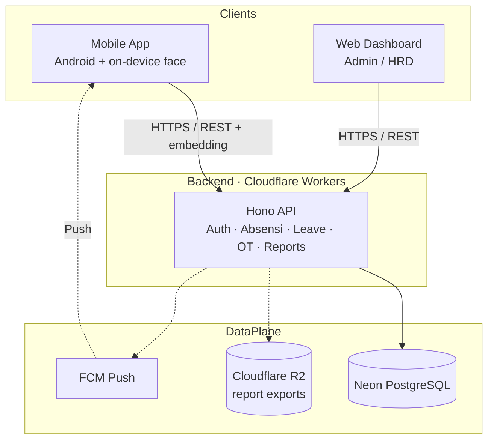
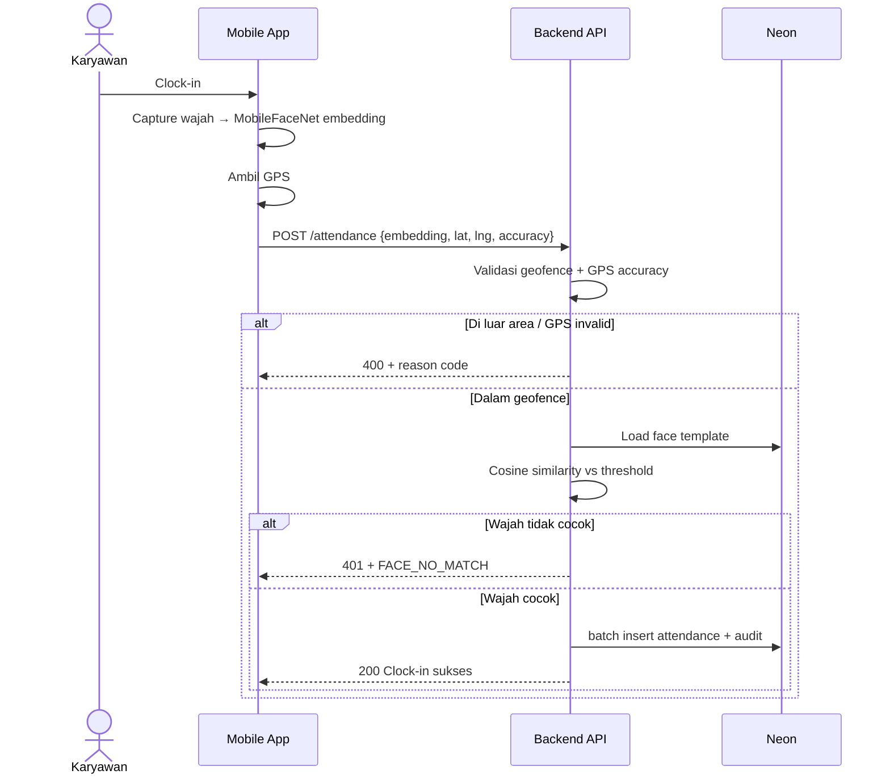
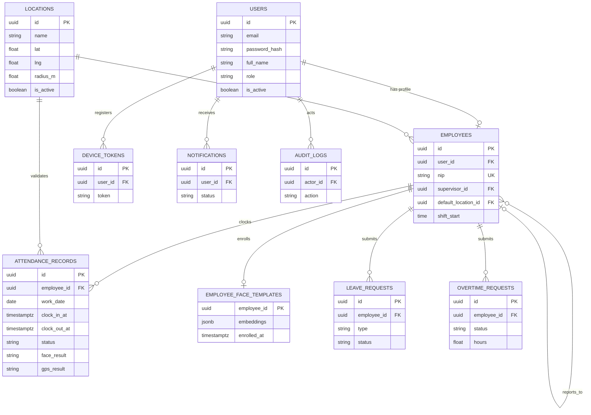
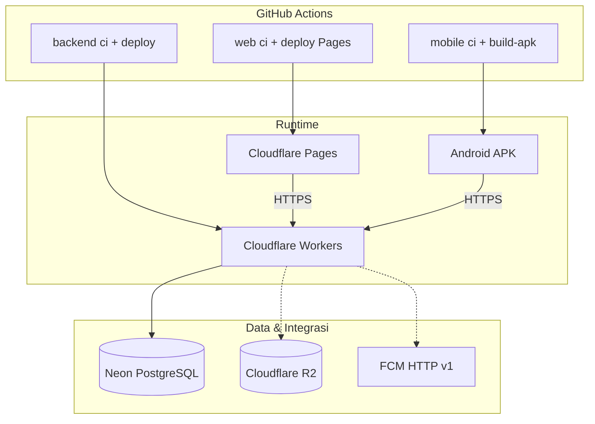

# Infrastructure Document

:::info Status
**Locked v1.0** — stack, face runtime, FCM, R2, ERD, timezone, dan kontrak OpenAPI terkunci untuk MVP.
:::

| Field | Value |
|-------|-------|
| Product | Nexus Ops — Aplikasi Absensi Divisi Operation |
| Version | 1.0.0 |
| Tim | Kelompok B — Capstone Project 50 Team B 2026 |
| Last updated | 2026-09-24 |

---

## 1. Tujuan dokumen

Dokumen ini mendeskripsikan arsitektur infrastruktur Nexus Ops: komponen sistem, lingkungan, penyimpanan data, keamanan, observabilitas, dan deployment. Semua keputusan ADR di §10 **terkunci** untuk semester ini.

Dokumen terkait: [PRD](./prd) · [Dev Setup](./dev-setup) · [Git Workflow](./git-workflow) · [SDLC](./sdlc)

---

## 2. Ringkasan arsitektur

| Lapisan | Komponen | Teknologi |
|---------|----------|-----------|
| Mobile | Aplikasi absensi karyawan (Android) | **React Native + Expo (SDK 57)** · Expo Router · TypeScript · Orval · **vision-camera + fast-tflite** (face) |
| Web | Dashboard admin / supervisor / HRD | **Vue 3 + Vite + TypeScript** · Vue Router · Orval · Vitest · Playwright |
| **API** | RESTful backend | **Bun + TypeScript + Hono** · Zod→OpenAPI · DDD modules |
| **Data** | Relational DB | **Neon (PostgreSQL)** · Drizzle ORM |
| AI/CV | Face recognition | **On-device MobileFaceNet** → embedding; Worker **cosine similarity** |
| Lokasi | GPS + geofencing | Device GPS + validasi server (Haversine / radius) |
| Storage | Ekspor laporan (Excel/PDF) | **Cloudflare R2** (signed URL) — **bukan** foto wajah |
| Push | Notifikasi | **Firebase Cloud Messaging (FCM)** HTTP v1 |
| Design | UI/UX | Figma (+ generator di `docs/figma-plugin`) |
| VCS / CI | Kolaborasi & otomatisasi | GitHub · GitHub Actions |

### Diagram konteks

### Alur validasi absensi (server) — terkunci

---

## 3. Komponen & tanggung jawab

### 3.1 Mobile application *(bootstrapped)*

| Aspek | Keputusan |
|-------|-----------|
| Stack | **React Native + Expo SDK 57** · TypeScript · Expo Router (`app/`) |
| Package | **npm** (`packageManager: npm@10.9.0`) |
| API client | **Orval** → Axios dari `openapi/openapi.json` |
| Auth token | AsyncStorage key `nexus_ops_token` *(secure storage OS dapat ditambah nanti)* |
| Face | `react-native-vision-camera` + `vision-camera-resize-plugin` + `react-native-fast-tflite` · model **MobileFaceNet** `.tflite` di `assets/models/` (112×112 → embedding 192-d, L2-normalized) |
| Dev client | **Expo Go tidak cukup** untuk face/camera native — wajib **dev client / debug APK** (`expo prebuild`) |
| Env | `EXPO_PUBLIC_APP_ENV`, `EXPO_PUBLIC_API_BASE_URL` |
| Quality | ESLint · Prettier · Husky · Jest (`src/lib` coverage **≥ 95%**) · **E2E Maestro** (manual gate vs APK; bukan CI) |
| Artefak | GitHub Actions APK debug (`expo prebuild` → Gradle; folder `android/` tidak di-commit) |
| Target OS | **Android** (MVP) |

### 3.2 Web dashboard *(bootstrapped)*

| Aspek | Keputusan |
|-------|-----------|
| Stack | **Vue 3 + Vite + TypeScript** · Vue Router |
| Package | **npm** |
| API client | **Orval** → Axios dari `openapi/openapi.json` |
| Env | `VITE_APP_ENV`, `VITE_API_BASE_URL`, `VITE_BASE_PATH` |
| Quality | ESLint · Prettier · Husky · Vitest (`src/lib` coverage **≥ 95%**) · **E2E Playwright** (job CI dengan API mock via `page.route`) |
| Deploy | **Cloudflare Pages** — trunk-based (`main` → `dev-nexus-ops-web`, tag `v*` → `nexus-ops-web`) |

### 3.3 Backend API *(implemented skeleton)*

| Aspek | Keputusan |
|-------|-----------|
| Runtime lokal | Bun (`bun run dev`) |
| Runtime produksi | **Cloudflare Workers** (`src/worker.ts` + Wrangler) |
| Framework HTTP | **Hono** + `@hono/zod-openapi` |
| OpenAPI | Auto dari Zod schemas → `/openapi.json` + UI `/docs` |
| Auth | **JWT** (HS256, `jose`) · RBAC: `employee` / `supervisor` / `hrd` · sesi **12 jam** |
| Password | `bcryptjs` |
| ORM | **Drizzle** |
| DB driver Worker | `@neondatabase/serverless` (HTTP) |
| Atomicity | **`db.batch()`** + invariant DB (unique / guarded `UPDATE … RETURNING`) — **bukan** interactive multi-statement TX |
| Arsitektur | **Pure DDD** — `src/modules/<bounded_context>/<aggregate>/` |

Modul:

| Context | Aggregate | Status |
|---------|-----------|--------|
| `identity` | `user` | Login + `/v1/auth/me` |
| `ops` | `dashboard` | Contract skeleton (501 sampai impl) |
| `attendance` | `record` | Placeholder → S3 |
| `leave` | `request` | Placeholder → S4 |
| `overtime` | `request` | Placeholder → S5 |
| `location` | `geofence` | Placeholder → S6 |

Endpoint hidup hari ini: `GET /health`, `POST /v1/auth/login`, `GET /v1/auth/me`, stubs dashboard.

### 3.4 Face recognition — **terkunci (D-05)**

| Aspek | Keputusan |
|-------|-----------|
| Runtime | **On-device** MobileFaceNet (TFLite); Worker **hanya** cosine similarity |
| Enrollment | `POST /v1/face/enrollments` body `{ embeddings: number[][] }` — **3** sampel → simpan sampel + mean |
| Clock-in/out | Payload `face: { embedding: number[], quality: number }` |
| Threshold | Cosine ≥ **`FACE_MATCH_THRESHOLD`** (default **0.65**) |
| Escape hatch | `FACE_MODE=stub` → terima embedding apa pun, catat `face_result = skipped` (untuk native build yang meleset) |
| Foto | **Tidak disimpan** (lihat D-09) |
| Limitasi MVP | Embedding dari klien *dipercaya*; mitigasi = JWT + rate limit + audit; anti-spoof **out of scope** |

### 3.5 GPS geofencing

- Device mengirim `lat`, `lng`, `accuracy_m`
- Server: titik dalam radius lokasi aktif org; default radius **100 m**; reject jika `accuracy_m > 50`
- Reason code: `OUT_OF_GEOFENCE`, `LOW_GPS_ACCURACY` (lihat [PRD §10.6](./prd#106-reason-code--enum))

### 3.6 Object storage — **Cloudflare R2 (D-06)**

- **Hanya** artefak ekspor laporan (Excel/PDF) + signed URL unduh
- Path per env: `dev/reports/…`, `prod/reports/…`
- Binding Wrangler: `[[r2_buckets]]` per environment
- **Bukan** untuk foto wajah / enrollment

### 3.7 Notifikasi — **FCM HTTP v1 (D-12)**

- Tanda tangan service-account JWT **RS256** (`jose` + `crypto.subtle`) → OAuth2 access token → FCM HTTP v1
- Cache access token per isolate Worker
- Outbox: baris `notifications` di `db.batch()` yang sama dengan domain write; pengiriman via cron Worker terpisah
- Tabel `device_tokens` untuk FCM registration token per user/device
- Event P0: status approval; P1: pengingat absensi

---

## 4. Lingkungan (environments)

| Environment | Tujuan | Runtime |
|-------------|--------|---------|
| **Local** | Pengembangan | Bun lokal + Neon (atau DB lokal opsional) |
| **Development** | Integrasi / preview API | Cloudflare Worker `dev-nexus-ops-api` · Neon **dev** |
| **Production** | Demo / operasional | Cloudflare Worker `nexus-ops-api` · Neon **prod** |

| Trigger | Cloudflare env | Worker name |
|---------|----------------|-------------|
| Push ke `main` | `development` | `dev-nexus-ops-api` |
| Tag `v*` | `production` | `nexus-ops-api` |

Contoh URL:

- Dev API: `https://dev-nexus-ops-api.dev-akmal69.workers.dev`
- Prod API: `https://nexus-ops-api.dev-akmal69.workers.dev`
- Dev web: `https://dev-nexus-ops-web.pages.dev`
- Prod web: `https://nexus-ops-web.pages.dev`

### Secret / env

| Variabel | Keterangan |
|----------|------------|
| `DATABASE_URL` | Neon connection string (per env) |
| `JWT_SECRET` | Shared secret HS256 (min 16 karakter) |
| `JWT_EXPIRES_IN` | Default `12h` |
| `APP_URL` | Base URL publik Worker (per env) |
| `APP_ENV` / `APP_NAME` | Vars Wrangler |
| `CORS_ORIGINS` | Origin web eksplisit (comma-separated); **bukan** `*` di prod |
| `R2_ACCOUNT_ID` / `R2_ACCESS_KEY_ID` / `R2_SECRET_ACCESS_KEY` / `R2_BUCKET` | R2 report exports |
| `FCM_PROJECT_ID` / `FCM_CLIENT_EMAIL` / `FCM_PRIVATE_KEY` | Service account FCM |
| `GEOFENCE_DEFAULT_RADIUS` | Default `100` (meter) |
| `FACE_MATCH_THRESHOLD` | Default `0.65` |
| `FACE_MODE` | `live` (default) \| `stub` |

---

## 5. Data & penyimpanan

### 5.1 Database — Neon PostgreSQL

Provider: **Neon**. Schema dikelola Drizzle (`drizzle/` migrations).

**Timezone (terkunci):**

- Semua timestamp disimpan **`timestamptz` UTC**
- `work_date date` = `(ts AT TIME ZONE 'Asia/Jakarta')::date`
- Default shift start **`08:00` WIB**; grace **15 menit** → terlambat jika clock-in setelah **08:15 WIB**
- Org timezone: **`Asia/Jakarta`** (`W-S01`)

**Sudah ada:**

| Tabel | Catatan |
|-------|---------|
| `users` | `id` UUID, `email`, `password_hash`, `full_name`, `role` (`employee`\|`supervisor`\|`hrd`), `is_active`, audit columns |

**ERD terkunci v1** (target migrasi S2–S6):

| Tabel | Kolom kunci |
|-------|-------------|
| `employees` | `id`, `user_id` FK unique, `nip` unique, `supervisor_id` FK nullable, `default_location_id` FK nullable, `shift_start` time default `08:00` |
| `locations` | `id`, `name`, `lat`, `lng`, `radius_m` default 100, `is_active` |
| `attendance_records` | `id`, `employee_id`, `work_date`, `clock_in_at`, `clock_out_at`, lat/lng in/out, `face_result`, `gps_result`, `status` (`present`\|`late`\|`absent`\|`leave`\|`holiday`), **`UNIQUE (employee_id, work_date)`** |
| `employee_face_templates` | `employee_id` PK/FK, `embeddings` jsonb (sampel + mean), `enrolled_at` |
| `leave_requests` | `employee_id`, `type` (`sick`\|`annual`\|`other`), `status` (`pending`\|`approved`\|`rejected`\|`cancelled`), dates, `reject_reason` |
| `overtime_requests` | `employee_id`, hours (max 4), `status`, `reject_reason` |
| `device_tokens` | `user_id`, `token`, `platform`, `updated_at` |
| `notifications` | outbox: `user_id`, `title`, `body`, `status` (`pending`\|`sent`\|`failed`), `fcm_message_id` |
| `audit_logs` | `actor_id`, `action`, `entity`, `entity_id`, `payload` jsonb, `created_at` |

**Login identifier:** mengandung `@` → cocokkan `users.email`; selain itu → cocokkan `employees.nip`.

### 5.2 Object storage (R2)

- Path: `{env}/reports/{yyyy}/{mm}/{file}`
- Retensi artefak laporan: **90 hari** lalu boleh dihapus (cron opsional)
- **Tidak ada retensi foto wajah** — embedding only (D-09)

### 5.3 Backup & recovery

| Item | Keputusan |
|------|-----------|
| DB backup | Neon automated PITR / branch sesuai plan |
| Retention DB | Mengikuti plan Neon; snapshot sebelum tag `v1.0.0` |
| Restore drill | Minimal **1×** sebelum demo akhir (S8) |

---

## 6. Jaringan, keamanan & akses

### Prinsip

- HTTPS (Workers / Pages)
- JWT Bearer · RBAC · secrets di Wrangler / GitHub Environments
- Embedding wajah: private DB column; tidak di-log penuh
- CORS: origin web dashboard **eksplisit** per env (`CORS_ORIGINS`)

### Checklist keamanan

- [x] JWT + hashed password (`bcryptjs`)
- [x] Role di claim / model user
- [ ] Rate limiting login & absensi
- [x] Tidak upload gambar wajah ke server (embedding only)
- [ ] CORS diperketat (hapus `*` di prod)
- [ ] Logging tanpa embedding penuh / password
- [ ] Least privilege service account FCM / R2

---

## 7. Deployment & CI/CD

### Repositories

| Repo | Link |
|------|------|
| Backend | [Capstone-Project-Team-B-2026/backend](https://github.com/Capstone-Project-Team-B-2026/backend) |
| Web | [Capstone-Project-Team-B-2026/web](https://github.com/Capstone-Project-Team-B-2026/web) |
| Mobile | [Capstone-Project-Team-B-2026/mobile](https://github.com/Capstone-Project-Team-B-2026/mobile) |
| Docs | [Capstone-Project-Team-B-2026/docs](https://github.com/Capstone-Project-Team-B-2026/docs) |

### Disiplin kontrak OpenAPI (terkunci)

1. Backend generate `openapi.json` dari Zod; **`info.version` wajib naik** setiap perubahan path/schema.
2. Publish: release asset backend **dan** mirror publik [`docs/static/openapi.json`](https://github.com/Capstone-Project-Team-B-2026/docs/blob/main/static/openapi.json).
   - Otomatis: workflow docs [`sync-openapi.yml`](https://github.com/Capstone-Project-Team-B-2026/docs/blob/main/.github/workflows/sync-openapi.yml) (cron 6 jam + `repository_dispatch` `openapi-updated` dari backend CI).
   - Secret: `PROJECT_TOKEN` di repo **docs** (dan opsional di **backend** untuk dispatch setelah push `main`).
3. Web/mobile: `npm run api:sync` (default curl mirror publik, tanpa PAT) → Orval. Job CI: sync + generate lalu `git diff --exit-code openapi/ src/api/` — klien basi **gagal CI**.
4. Design tokens: `docs/static/tokens.json` → `npm run tokens:sync` di web (`src/styles/tokens.ts`) / mobile (`src/theme/tokens.ts`).

### Pipeline

| Repo | CI | Deploy / artefak |
|------|----|------------------|
| **Backend** | format · lint · tsc · unit coverage ≥95% · **integration** (postgres service + `drizzle-kit push` + `app.request`) | `main` → Worker dev · `v*` → prod |
| **Web** | format · lint · tsc · unit ≥95% (`src/lib`) · **OpenAPI anti-drift** · **E2E Playwright smoke** | Pages `dev-nexus-ops-web` / `nexus-ops-web` |
| **Mobile** | format · lint · tsc · unit ≥95% (`src/lib`) · **OpenAPI anti-drift** | APK artifact; **Maestro = gate manual** (bukan CI) |
| **Docs** | Docusaurus build · `project-sprint-backlog.yml` · **`sync-openapi.yml`** | GitHub Pages |

---

## 8. Observabilitas

| Aspek | Approach |
|-------|----------|
| Logging | Structured (request id, role, endpoint, latency, reason_code) — tanpa embedding penuh |
| Metrics | Error rate, latency p95 absensi, FCM failure rate |
| Alerting | **GitHub Issues** auto dari failed deploy workflow + channel Discord/Slack tim (webhook) bila Worker down |
| Audit | `audit_logs` + hasil face/GPS di `attendance_records` |

---

## 9. Kapasitas & asumsi skala

- Pengguna: satu divisi Operation (puluhan–ratusan)
- Spike clock-in di awal shift
- Laporan: generate on-demand → R2 signed URL

**Neon HTTP:** tidak ada interactive multi-statement TX — gunakan `db.batch()` + unique/guarded updates + outbox (lihat §3.3).

---

## 10. Keputusan (ADR)

| ID | Keputusan | Status | Catatan |
|----|-----------|--------|---------|
| D-01 | Stack mobile | **Dipilih** | RN + Expo 57 · Expo Router · Orval · APK via Actions · **dev client** untuk face |
| D-02 | Stack web | **Dipilih** | Vue 3 + Vite · Orval · Cloudflare Pages · Playwright |
| D-03 | Stack API | **Dipilih** | Bun + Hono + Zod OpenAPI + DDD |
| D-04 | Database | **Dipilih** | Neon PostgreSQL + Drizzle |
| D-05 | Face recognition runtime | **Dipilih** | On-device MobileFaceNet → Worker cosine (≥0.65); `FACE_MODE=stub` escape |
| D-06 | Object storage | **Dipilih** | Cloudflare R2 **untuk ekspor laporan saja** |
| D-07 | Hosting API | **Dipilih** | Cloudflare Workers |
| D-08 | Auth token | **Dipilih** | JWT Bearer · expiry 12h |
| D-09 | Retensi foto wajah | **Dipilih** | **Tidak ada foto** — embedding only di DB |
| D-10 | Package managers | **Dipilih** | Bun (backend, docs) · npm (web, mobile) |
| D-11 | OpenAPI → klien | **Dipilih** | Version bump wajib · publish ke docs static · CI anti-drift |
| D-12 | Push notification | **Dipilih** | FCM HTTP v1 + in-app feed + outbox |
| D-13 | Timezone | **Dipilih** | `Asia/Jakarta` · `work_date` lokal · timestamptz UTC |
| D-14 | Atomic writes | **Dipilih** | `db.batch()` + DB invariants + notification outbox |

---

## 11. Rencana implementasi infrastruktur

Selaras [SDLC §4](./sdlc).

| Sprint | Aktivitas |
|--------|-----------|
| S1 | Inventaris NFR; env & secret policy |
| S2 | Stack API, Neon, Workers, OpenAPI, CI; bootstrap web & mobile + Orval |
| S3–S5 | Attendance + face + geofence API **paralel** UI; wiring FCM; R2 untuk reports |
| S5–S6 | Harden CI APK / Pages; face enroll; geofence master |
| S7 | Integrasi & mulai UAT |
| S8 | Production tag, restore drill, evaluasi, dokumentasi final |

---

## 12. Risiko infrastruktur

| Risiko | Mitigasi |
|--------|----------|
| Neon HTTP tanpa interactive TX | `db.batch()` + unique `(employee_id, work_date)` + guarded updates |
| CORS `*` | Kunci `CORS_ORIGINS` ke Pages URL sebelum prod formal |
| Native face build gagal di S3 | `FACE_MODE=stub` tanpa ubah kontrak |
| Embedding dipercaya dari klien | JWT + rate limit + audit; anti-spoof out of scope |
| Secret bocor | Env example saja; secrets di GitHub / Wrangler |
| Downtime demo | Smoke H-1 pada Worker + Pages |

---

## 13. Riwayat revisi

| Versi | Tanggal | Perubahan |
|-------|---------|-----------|
| 0.1.0 | 2026-09-22 | Draft awal dari proposal capstone Kelompok B |
| 0.2.0 | 2026-09-23 | Selaraskan dengan backend aktual |
| 0.2.1 | 2026-09-24 | Rencana infra per sprint 1 minggu |
| 0.3.0 | 2026-09-24 | Klien terkunci: Vue Pages + RN Expo |
| 0.3.1 | 2026-09-24 | ADR D-06 R2 + D-12 FCM |
| 1.0.0 | 2026-09-24 | **Locked:** D-05 face on-device, D-09 embedding-only, ERD v1, timezone, batch/outbox, CORS, OpenAPI anti-drift, R2=reports |

---

## Referensi

- Backend / Web / Mobile README & AGENTS di org [Capstone-Project-Team-B-2026](https://github.com/Capstone-Project-Team-B-2026)
- [Product Requirements Document (PRD)](./prd)
- [Development Tools Setup](./dev-setup)
- [Git Workflow](./git-workflow)
- [Introduction](./)
