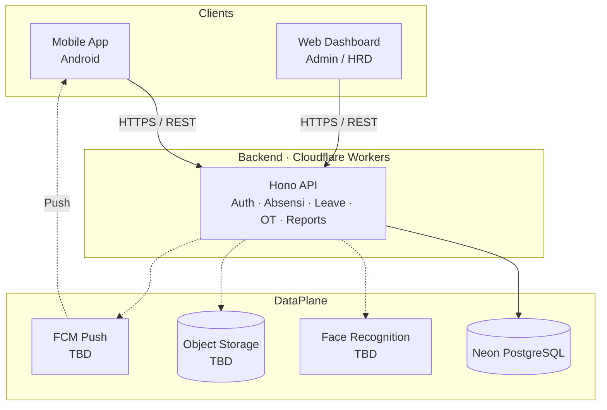
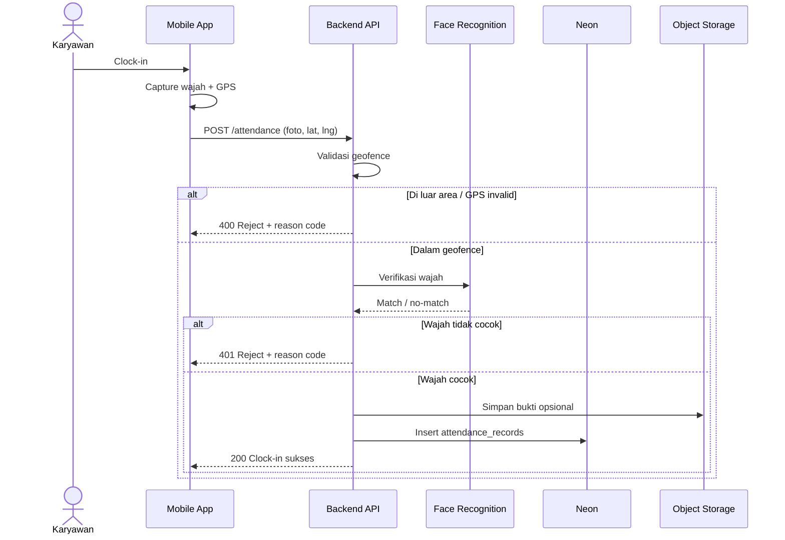
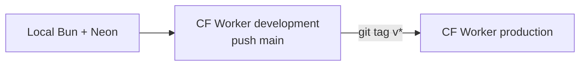
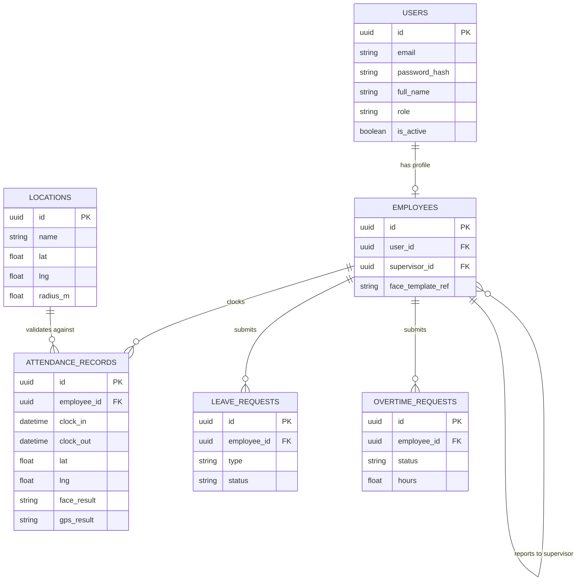
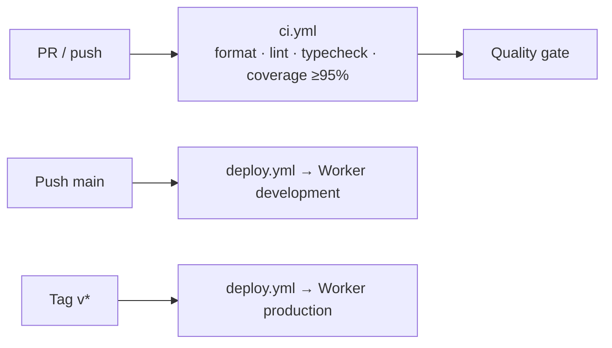
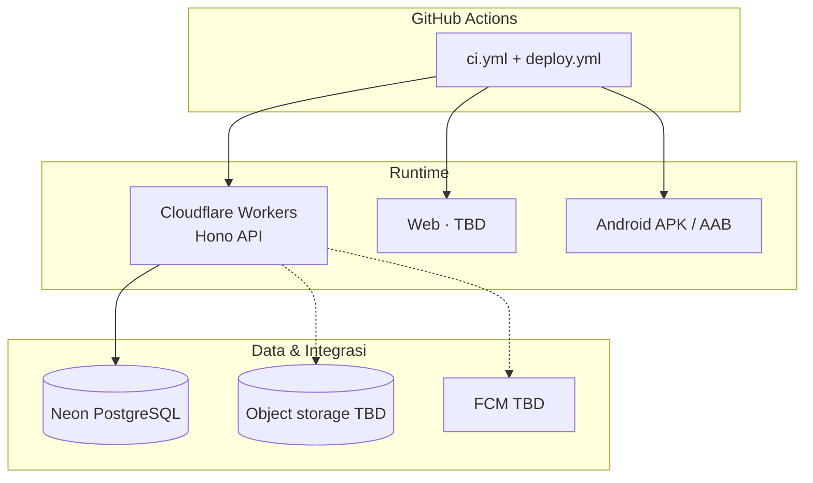

# Infrastructure Document

:::info Status
**Draft (stack backend + klien terkunci)** — backend Bun/Hono/Neon/Workers; web Vue 3 + Orval + GH Pages; mobile Vue 3 + Capacitor + APK CI. Face/storage/push masih terbuka.
:::

| Field | Value |
|-------|-------|
| Product | Nexus Ops — Aplikasi Absensi Divisi Operation |
| Version | 0.2.0 (Draft) |
| Tim | Kelompok B — Capstone Project 50 Team B 2026 |
| Last updated | 2026-09-23 |

---

## 1. Tujuan dokumen

Dokumen ini mendeskripsikan arsitektur infrastruktur Nexus Ops: komponen sistem, lingkungan, penyimpanan data, keamanan, observabilitas, dan deployment. **Backend API sudah di-bootstrap** di repo terpisah; bagian klien & layanan pendukung (face, FCM, object storage) masih mengikuti rencana proposal.

Dokumen terkait: [Product Requirements Document (PRD)](./prd)

---

## 2. Ringkasan arsitektur

Sistem terdiri dari tiga permukaan klien + backend API + layanan pendukung:

| Lapisan | Komponen | Teknologi |
|---------|----------|-----------|
| Mobile | Aplikasi absensi karyawan (Android) | **Vue 3 + Capacitor** |
| Web | Dashboard admin / supervisor / HRD | **Vue 3 + Vite** |
| **API** | RESTful backend | **Bun + TypeScript + Hono** · Zod→OpenAPI · DDD modules |
| **Data** | Relational DB | **Neon (PostgreSQL)** · Drizzle ORM |
| AI/CV | Face recognition service | face-api.js **atau** Python `face_recognition` *(TBD)* |
| Lokasi | GPS + geofencing | Geolocation API (device) + validasi server |
| Storage | Objek (foto enroll / bukti absensi) | Firebase Storage **atau** R2/S3 *(TBD)* |
| Push | Notifikasi | Firebase Cloud Messaging (FCM) *(TBD)* |
| Design | UI/UX | Figma (+ generator di `docs/figma-plugin`) |
| VCS / CI | Kolaborasi & otomatisasi | GitHub · GitHub Actions |

### Diagram konteks

### Alur validasi absensi (server) — target

---

## 3. Komponen & tanggung jawab

### 3.1 Mobile application

- Clock-in/out, kamera (capture wajah), GPS, pengajuan izin/cuti/lembur
- Menerima push notification
- Menyimpan token sesi secara aman (secure storage OS)
- **Target OS:** Android (MVP)

### 3.2 Web dashboard

- Monitoring kehadiran real-time / rekap
- Approval supervisor (opsional juga di mobile — TBD)
- Manajemen user & master data (HRD)
- Generate / unduh laporan PDF & Excel

### 3.3 Backend API *(implemented skeleton)*

| Aspek | Keputusan |
|-------|-----------|
| Runtime lokal | Bun (`bun run dev`) |
| Runtime produksi | **Cloudflare Workers** (`src/worker.ts` + Wrangler) |
| Framework HTTP | **Hono** + `@hono/zod-openapi` |
| OpenAPI | Auto dari Zod schemas → `/openapi.json` + UI `/docs` |
| Auth | **JWT** (HS256, `jose`) · RBAC role: `employee` / `supervisor` / `hrd` |
| Password | `bcryptjs` (kompatibel Workers; bukan `Bun.password` di path runtime) |
| ORM | **Drizzle** |
| DB driver Worker | `@neondatabase/serverless` (HTTP) |
| DB driver migrate/seed | `postgres.js` (TCP ke Neon) |
| Arsitektur | **Pure DDD** — `src/modules/<bounded_context>/<aggregate>/` |

Modul saat ini:

| Context | Aggregate | Status |
|---------|-----------|--------|
| `identity` | `user` | Login + `/v1/auth/me` |
| `attendance` | `record` | Placeholder |
| `leave` | `request` | Placeholder |
| `overtime` | `request` | Placeholder |
| `location` | `geofence` | Placeholder |

Endpoint hidup: `GET /health`, `POST /v1/auth/login`, `GET /v1/auth/me`.

### 3.4 Face recognition

- Enrollment wajah karyawan (template/embedding)
- Verifikasi pada clock-in/out
- Library siap pakai; **tidak** train model dari nol (sesuai batasan PRD)
- Runtime (in-process vs service) masih **TBD**

### 3.5 GPS geofencing

- Device mengirim koordinat saat absensi
- Server memvalidasi titik berada dalam radius/polygon lokasi kerja
- Menyimpan reason code jika ditolak (`OUT_OF_GEOFENCE`, akurasi rendah, dll.)

### 3.6 Object storage

- Menyimpan foto enrollment / snapshot verifikasi (jika disimpan)
- Akses terbatas (signed URL / private bucket) — vendor **TBD**

### 3.7 Notifikasi

- FCM untuk Android *(wiring TBD)*
- Event: status approval, pengingat absensi, deadline pengajuan

---

## 4. Lingkungan (environments)

Backend memakai **trunk-based** deploy, bukan staging container terpisah:

| Environment | Tujuan | Runtime |
|-------------|--------|---------|
| **Local** | Pengembangan | Bun lokal + Neon (atau DB lokal opsional) |
| **Development** | Integrasi / preview API | Cloudflare Worker `dev-nexus-ops-api` · Neon branch/DB **dev** |
| **Production** | Demo / operasional | Cloudflare Worker `nexus-ops-api` · Neon branch/DB **prod** |

| Trigger | Cloudflare env | Worker name |
|---------|----------------|-------------|
| Push ke `main` | `development` | `dev-nexus-ops-api` |
| Tag `v*` (mis. `v0.1.0`) | `production` | `nexus-ops-api` |

Contoh URL publik (akun Cloudflare tim):

- Dev: `https://dev-nexus-ops-api.dev-akmal69.workers.dev`
- Prod: `https://nexus-ops-api.dev-akmal69.workers.dev`

### Naming & konfigurasi

Secret / env (tidak di Git):

| Variabel | Keterangan |
|----------|------------|
| `DATABASE_URL` | Neon connection string (per env) |
| `JWT_SECRET` | Shared secret HS256 (min 16 karakter) |
| `APP_URL` | Base URL publik Worker (per env) |
| `APP_ENV` / `APP_NAME` / `JWT_EXPIRES_IN` / `CORS_ORIGINS` | Vars Wrangler (bukan secret) |

Nanti: `FCM_*`, storage credentials, `GEOFENCE_DEFAULT_RADIUS`, dll.

---

## 5. Data & penyimpanan

### 5.1 Database — Neon PostgreSQL

Provider: **Neon**. Schema dikelola Drizzle (`drizzle/` migrations).

**Sudah ada di migrasi awal:**

| Tabel | Catatan |
|-------|---------|
| `users` | `id` UUID, `email`, `password_hash`, `full_name`, `role` enum (`employee`\|`supervisor`\|`hrd`), `is_active`, audit `created_at` / `updated_at` / `created_by` / `updated_by` |

**Direncanakan (selaras PRD):**

| Entitas | Deskripsi singkat |
|---------|-------------------|
| `employees` | Profil karyawan, relasi supervisor, enroll face ref |
| `locations` / `geofences` | Titik/radius lokasi kerja |
| `attendance_records` | Clock-in/out, lat/lng, hasil face & GPS |
| `leave_requests` | Izin/cuti + status approval |
| `overtime_requests` | Lembur + status approval |
| `notifications` | Log / outbox notifikasi (opsional) |
| `audit_logs` | Jejak aksi sensitif |

### ERD target (draft)

### 5.2 Object storage

- Path terpisah per environment: `dev/`, `prod/`
- Retensi foto verifikasi: **TBD**

### 5.3 Backup & recovery

| Item | Rencana |
|------|---------|
| DB backup | Neon automated backup (branch/point-in-time sesuai plan) |
| Retention | Mengikuti kebijakan Neon + kebutuhan audit (TBD) |
| Restore drill | Minimal 1x sebelum demo akhir |

---

## 6. Jaringan, keamanan & akses

### Prinsip

- Trafik klien ↔ API memakai **HTTPS** (Workers)
- Autentikasi **JWT Bearer** (sudah diimplementasikan untuk login/me)
- **RBAC** sesuai persona PRD (`employee` / `supervisor` / `hrd`)
- Secret di GitHub Environments / Wrangler secrets — tidak di Git
- Face template & foto: akses private (saat fitur hadir)

### Checklist keamanan

- [x] JWT + hashed password (`bcryptjs`)
- [x] Role di claim / model user
- [ ] Rate limiting pada endpoint login & absensi
- [ ] Validasi input & ukuran upload gambar
- [ ] CORS diperketat ke origin web dashboard (saat ini `*` di Worker vars — tinjau sebelum prod ketat)
- [ ] Logging tanpa data sensitif berlebihan
- [ ] Least privilege untuk service account storage/FCM

---

## 7. Deployment & CI/CD

### Repositories

| Repo | Link |
|------|------|
| Backend | [Capstone-Project-Team-B-2026/backend](https://github.com/Capstone-Project-Team-B-2026/backend) |
| Web | [Capstone-Project-Team-B-2026/web](https://github.com/Capstone-Project-Team-B-2026/web) |
| Mobile | [Capstone-Project-Team-B-2026/mobile](https://github.com/Capstone-Project-Team-B-2026/mobile) |
| Docs | [Capstone-Project-Team-B-2026/docs](https://github.com/Capstone-Project-Team-B-2026/docs) |

### Pipeline backend (aktual)

| Workflow | Isi |
|----------|-----|
| `.github/workflows/ci.yml` | Prettier check, ESLint, `tsc`, `bun test --coverage` (threshold **≥ 95%**) |
| `.github/workflows/deploy.yml` | Test/coverage → upload secrets → `wrangler deploy` |

Lokal: Husky + lint-staged (eslint --fix + prettier) pada pre-commit; juga `openapi:export` + stage `openapi.json`.

### Pipeline web & mobile

| Repo | CI | Deploy / artefak |
|------|----|------------------|
| **Web** | format · lint · typecheck · test (coverage soft, tidak digate ≥95%) | `main` → GH Pages `/web/dev/` · tag `v*` → `/web/` |
| **Mobile** | format · lint · typecheck · test | `main` → APK debug (dev artifact) · tag `v*` → APK debug (stg artifact) |

Klien memakai **Orval** dari salinan `openapi/openapi.json` (sync manual dari backend `main` via `api:sync`).

### Deployment view

| Komponen | Strategi |
|----------|----------|
| **Backend** | Cloudflare Workers + Neon · trunk-based (`main` → dev, `v*` → prod) |
| Web | **GitHub Pages** (`main` → `/dev`, tag `v*` → `/`) |
| Mobile | **GitHub Actions** APK artifact (`main` → dev, tag `v*` → stg) |
| Docs | Docusaurus → GitHub Pages |

---

## 8. Observabilitas

| Aspek | Approach |
|-------|----------|
| Logging | Structured logs (request id, role, endpoint, latency) — diperkaya bertahap |
| Metrics | Error rate, latency p95 absensi, FCM failure *(saat fitur ada)* |
| Alerting | Channel tim jika Worker/API down (TBD tool) |
| Audit | Persist hasil face/GPS pada `attendance_records` |

---

## 9. Kapasitas & asumsi skala

- Pengguna: satu divisi Operation (puluhan–ratusan — dikonfirmasi wawancara)
- Pola beban: spike clock-in di awal shift
- Laporan: generate on-demand

Neon + Workers cocok untuk spike ringan; laporan berat dapat diantrikan (P1) jika perlu.

**Catatan Workers:** Neon HTTP driver **tidak** mendukung interactive transaction multi-statement — use case yang butuh atomicity multi-query harus memakai batch Neon atau desain ulang (lihat `AGENTS.md` backend).

---

## 10. Keputusan (ADR)

| ID | Keputusan | Status | Catatan |
|----|-----------|--------|---------|
| D-01 | Stack mobile | **Dipilih** | Vue 3 + Capacitor (Android) · Orval dari OpenAPI |
| D-02 | Stack web | **Dipilih** | Vue 3 + Vite · Orval dari OpenAPI · GH Pages |
| D-03 | Stack API | **Dipilih** | Bun + TypeScript + Hono + Zod OpenAPI + DDD |
| D-04 | Database | **Dipilih** | Neon PostgreSQL + Drizzle |
| D-05 | Face recognition runtime | **Terbuka** | Embedded vs service |
| D-06 | Object storage | **Terbuka** | Firebase vs R2/S3 |
| D-07 | Hosting API | **Dipilih** | Cloudflare Workers |
| D-08 | Auth token | **Dipilih** | JWT Bearer |
| D-09 | Retensi foto wajah | **Terbuka** | Legal/privacy + stakeholder |

---

## 11. Rencana implementasi infrastruktur

| Minggu | Aktivitas |
|--------|-----------|
| 1 | Inventaris NFR; draft env & secret policy |
| 2 | **Done (backend):** stack API, Neon, Workers bootstrap, OpenAPI, CI coverage |
| 3–4 | Attendance + face + geofence API; storage & FCM spike |
| 4–6 | CI mobile/web; harden development Worker |
| 6–7 | Integrasi & UAT terhadap API development/production |
| 8 | Production tag release, backup check, evaluasi, dokumentasi final |

---

## 12. Risiko infrastruktur

| Risiko | Mitigasi |
|--------|----------|
| Batasan transaction Neon HTTP di Workers | Desain use case tanpa multi-statement TX; batch API bila perlu |
| CORS `*` di Worker | Kunci ke origin web sebelum prod formal |
| Biaya / latency face recognition | Cache embedding; batasi resolusi; queue |
| Ketergantungan GPS device | Timeout UX; radius geofence configurable |
| Secret bocor | Env example saja; secrets di GitHub Environments / Wrangler |
| Downtime demo | Smoke test H-1 pada Worker development + production |

---

## 13. Riwayat revisi

| Versi | Tanggal | Perubahan |
|-------|---------|-----------|
| 0.1.0 | 2026-09-22 | Draft awal dari proposal capstone Kelompok B |
| 0.2.0 | 2026-09-23 | Selaraskan dengan backend aktual: Bun/Hono/Drizzle/Neon/Workers, CI, JWT, env trunk-based |

---

## Referensi

- Backend README / AGENTS: [Capstone-Project-Team-B-2026/backend](https://github.com/Capstone-Project-Team-B-2026/backend)
- Proposal Capstone Project — Pengembangan Aplikasi Absensi Divisi Operation (Kelompok B, 2026)
- [Product Requirements Document (PRD)](./prd)
- [Introduction](./)
