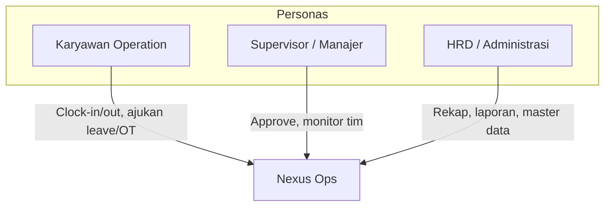
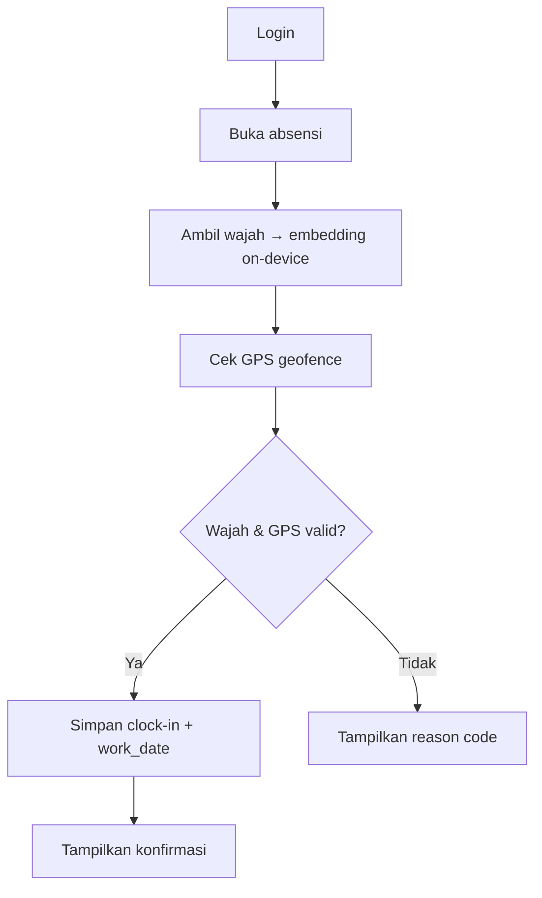
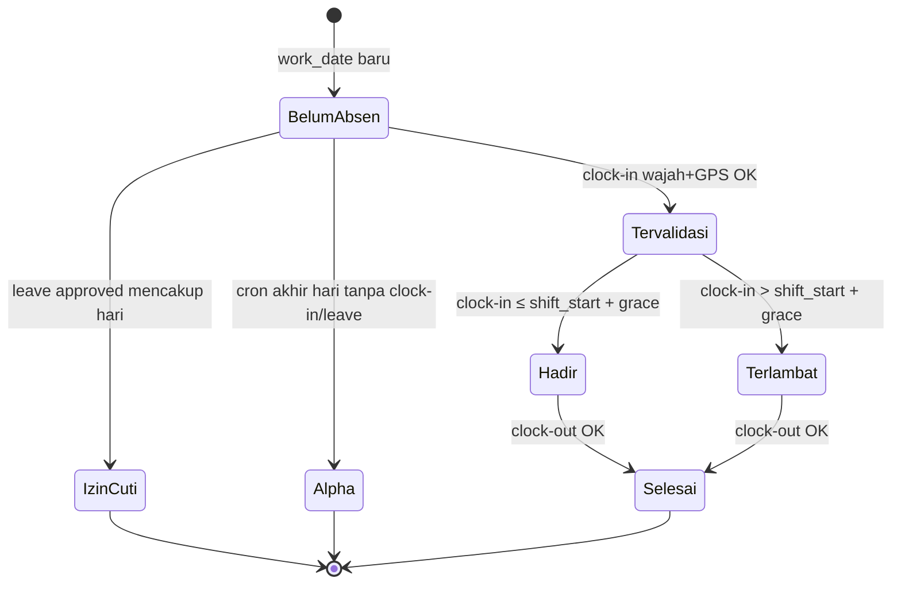
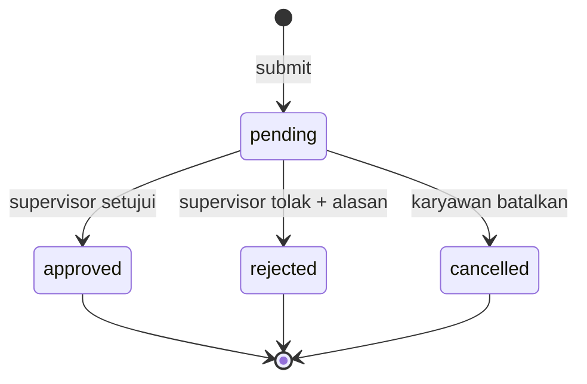
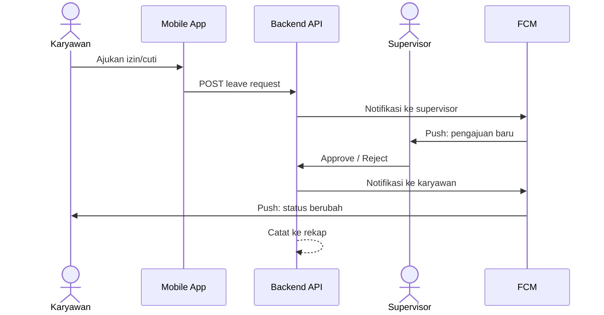
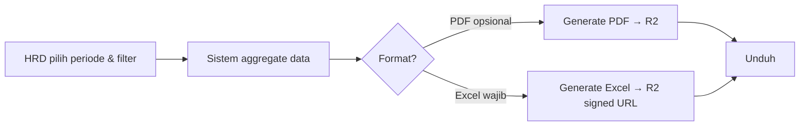
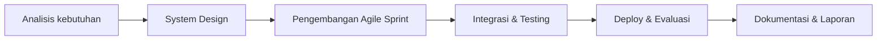

# Product Requirements Document (PRD)

:::info Status
**Locked v1.0** — keputusan domain, NFR, state machine, enum, dan face runtime terkunci untuk MVP. Perubahan rule memerlukan update PRD + persetujuan Project Leader.
:::

| Field | Value |
|-------|-------|
| Product | Nexus Ops — Aplikasi Absensi Divisi Operation |
| Version | 1.0.0 |
| Mata Kuliah | STSI4440 |
| Tim | Kelompok B — Capstone Project 50 Team B 2026 |
| Last updated | 2026-09-24 |

---

## 1. Ringkasan produk

Nexus Ops adalah sistem absensi digital untuk **Divisi Operation** yang mencatat kehadiran secara real-time dengan validasi identitas (face recognition) dan lokasi (GPS geofencing), serta mengintegrasikan pengelolaan izin/cuti, lembur, dashboard monitoring, dan laporan otomatis.

### Masalah yang diselesaikan

- Pencatatan absensi manual (kertas / spreadsheet) rentan error, manipulasi, dan terlambat dilaporkan.
- Lokasi kerja tersebar, sistem shift, serta izin/cuti yang dinamis sulit dipantau secara real-time.
- Manajemen kesulitan memperoleh data kehadiran yang akurat untuk payroll, evaluasi kinerja, dan disiplin kerja.

### Value proposition

Satu platform absensi yang akurat, aman, dan terpantau secara real-time — dari clock-in karyawan hingga laporan untuk manajemen dan HRD.

---

## 2. Latar belakang & tujuan

### Tujuan bisnis

1. Mencatat dan memantau kehadiran karyawan Divisi Operation secara digital dan real-time.
2. Meningkatkan akurasi & keamanan data melalui face recognition dan GPS geofencing.
3. Mengintegrasikan izin, cuti, dan lembur dalam satu platform.
4. Menyediakan dashboard interaktif dan pelaporan otomatis bagi manajemen.

### Tujuan keberhasilan (success metrics — terkunci)

| Metrik | Target | Catatan |
|--------|--------|---------|
| Accuracy clock-in valid | ≥ 95% kehadiran tervalidasi wajah + GPS | Diukur pada UAT |
| Waktu rekap laporan | &lt; 5 menit generate Excel (PDF opsional) | Vs proses manual |
| Adoption UAT | ≥ 80% skenario utama lulus | Karyawan + supervisor + HRD |
| Latency notifikasi | &lt; 1 menit setelah event | Status izin/cuti, pengingat |

*Rule domain pendukung: [§10](#10-keputusan-domain-terkunci-mvp).*

---

## 3. Pengguna & persona

| Persona | Peran | Kebutuhan utama |
|---------|-------|-----------------|
| **Karyawan Operation** | Pengguna utama absensi | Clock-in/out cepat, ajukan izin/cuti/lembur, terima notifikasi |
| **Supervisor / Manajer** | Penyetuju & monitoring | Setujui/tolak pengajuan, pantau kehadiran tim real-time |
| **HRD / Administrasi** | Rekap & pelaporan | Rekap data, generate laporan payroll/audit, kelola master data |

---

## 4. Ruang lingkup

### In scope (MVP / semester ini)

1. **Absensi digital** — clock-in/clock-out + face recognition + GPS geofencing
2. **Izin & cuti** — pengajuan, persetujuan, pencatatan, notifikasi
3. **Lembur** — input & persetujuan terintegrasi data kehadiran
4. **Dashboard monitoring** — kehadiran harian, rekap mingguan/bulanan, statistik keterlambatan/ketidakhadiran
5. **Laporan otomatis** — ekspor PDF/Excel
6. **Notifikasi** — push notification (absensi, status approval, deadline)
7. **Platform** — mobile Android + web dashboard admin
8. **Backend API** — REST API untuk autentikasi, absensi, dan layanan validasi

### Out of scope / batasan

| Batasan | Keterangan |
|---------|------------|
| Scope organisasi | Khusus Divisi Operation (ekspansi divisi lain = fase berikutnya) |
| Face recognition | Pakai library siap pakai; tidak train model dari nol |
| Integrasi payroll | Hanya ekspor data; tidak sinkron langsung ke sistem payroll existing |
| Platform mobile | Fokus Android (iOS dapat dipertimbangkan kemudian) |
| Storage | Database lokal/cloud perusahaan sesuai keputusan infrastruktur |
| Face override supervisor | **CUT MVP** — absensi gagal face tetap retry / hubungi HRD re-enroll |
| Lupa password self-service | **CUT MVP** — reset oleh HRD lewat kelola akun |
| Kuota/saldo cuti | **CUT MVP** — jenis leave enum saja |
| Roster shift per karyawan | **CUT MVP** — satu default shift organisasi |
| Approve di mobile | **CUT MVP** — supervisor approve hanya di web |
| Quiet hours / preferensi lanjut | Preferensi quiet hours = P2; **FCM + in-app feed dipakai untuk approval P0** |
| Object storage | **Cloudflare R2** (bukan Firebase Storage) |

---

## 5. User stories & requirements fungsional

Prioritas: **P0** = harus ada di MVP · **P1** = penting · **P2** = nice-to-have / fase lanjut

### 5.1 Autentikasi & akun

| ID | User story | Priority |
|----|------------|----------|
| AUTH-01 | Sebagai karyawan, saya dapat login agar mengakses fitur absensi. | P0 |
| AUTH-02 | Sebagai admin/HRD, saya dapat mengelola akun pengguna (aktif/nonaktif, role). | P0 |
| AUTH-03 | Sebagai sistem, saya menegakkan role-based access (Karyawan / Supervisor / HRD). | P0 |

### 5.2 Absensi (clock-in / clock-out)

| ID | User story | Priority |
|----|------------|----------|
| ATT-01 | Sebagai karyawan, saya dapat clock-in/out dari aplikasi mobile. | P0 |
| ATT-02 | Sebagai sistem, saya memvalidasi wajah karyawan sebelum menyimpan absensi. | P0 |
| ATT-03 | Sebagai sistem, saya memvalidasi lokasi berada dalam area geofence yang diizinkan. | P0 |
| ATT-04 | Sebagai karyawan, saya melihat status absensi hari ini (sudah/belum clock-in, jam masuk/keluar). | P0 |
| ATT-05 | Sebagai sistem, saya mencatat timestamp, lokasi, dan hasil validasi untuk audit. | P0 |
| ATT-06 | Sebagai supervisor, saya melihat daftar karyawan yang belum absen pada shift berjalan. **Definisi:** karyawan `is_active` yang belum punya baris `attendance_records` untuk `work_date` hari ini (Asia/Jakarta). | P1 |

### 5.3 Izin & cuti

| ID | User story | Priority |
|----|------------|----------|
| LV-01 | Sebagai karyawan, saya dapat mengajukan izin/cuti dengan tanggal, jenis, dan keterangan. | P0 |
| LV-02 | Sebagai supervisor, saya dapat menyetujui atau menolak pengajuan. | P0 |
| LV-03 | Sebagai karyawan, saya menerima notifikasi saat status pengajuan berubah. | P0 |
| LV-04 | Sebagai HRD, saya dapat melihat riwayat izin/cuti untuk rekap. | P1 |

### 5.4 Lembur

| ID | User story | Priority |
|----|------------|----------|
| OT-01 | Sebagai karyawan, saya dapat mengajukan jam lembur terkait kehadiran. | P0 |
| OT-02 | Sebagai supervisor, saya dapat menyetujui/menolak lembur. | P0 |
| OT-03 | Sebagai HRD, data lembur masuk ke laporan untuk keperluan payroll. | P1 |

### 5.5 Dashboard & laporan

| ID | User story | Priority |
|----|------------|----------|
| RPT-01 | Sebagai manajer, saya melihat dashboard kehadiran real-time (harian). | P0 |
| RPT-02 | Sebagai manajer/HRD, saya melihat rekap mingguan/bulanan & statistik keterlambatan. | P0 |
| RPT-03 | Sebagai HRD, saya dapat generate laporan PDF/Excel. | P0 |
| RPT-04 | Sebagai sistem, laporan dapat difilter per periode / karyawan / status. | P1 |

### 5.6 Notifikasi

| ID | User story | Priority |
|----|------------|----------|
| NTF-01 | Sebagai karyawan, saya menerima pengingat absensi (mis. mendekati jam shift). | P1 |
| NTF-02 | Sebagai karyawan/supervisor, saya menerima notifikasi status approval. | P0 |
| NTF-03 | Sebagai karyawan, saya mendapat pengingat deadline pengajuan bila relevan. | P2 |

---

## 6. Requirements non-fungsional (terkunci)

| Kategori | Requirement | Target |
|----------|-------------|--------|
| **Keamanan** | JWT Bearer; embedding wajah tidak di-log penuh; RBAC | HTTPS, bcrypt, least privilege; sesi **12 jam** |
| **Akurasi** | Validasi ganda (wajah + GPS) sebelum absensi diterima | Reject jika salah satu gagal; face cosine ≥ **0.65**; GPS accuracy ≤ **50 m** |
| **Ketersediaan** | Layanan API selama jam operasional | Best-effort **07:00–18:00 WIB**; smoke H-1 sebelum demo |
| **Performa** | Respons API | p95 umum **&lt; 1.5 s**; absensi (clock-in/out) **&lt; 3 s** |
| **Usabilitas** | Clock-in singkat di mobile | ≤ 3 langkah utama setelah buka app |
| **Auditability** | Absensi & approval tercatat | `audit_logs` + fields face/GPS di attendance |
| **Portabilitas data** | Ekspor laporan | **Excel wajib**; PDF nice-to-have |

---

## 7. Alur proses utama (ringkas)

### Clock-in

### State machine — hari absensi

| Status API (`attendance_status`) | Label UI |
|----------------------------------|----------|
| `present` | Hadir |
| `late` | Terlambat |
| `absent` | Alpha |
| `leave` | Izin |
| `holiday` | Libur (opsional org) |

### State machine — approval (leave / OT)

| Status API (`request_status`) | Label UI |
|-------------------------------|----------|
| `pending` | Menunggu |
| `approved` | Disetujui |
| `rejected` | Ditolak |
| `cancelled` | Dibatalkan |

### Pengajuan izin/cuti

### Generate laporan

### Metodologi pengerjaan

State machine absensi & approval terkunci di atas; ERD terkunci di [Infrastructure §5.1](./infrastructure#51-database--neon-postgresql).
---

## 8. Asumsi & dependensi

### Asumsi

- Karyawan memiliki perangkat Android dengan kamera dan GPS.
- Area kerja memiliki batas geofence yang dapat didefinisikan.
- Template wajah karyawan tersedia / dapat di-enroll saat onboarding.
- Stakeholder Divisi Operation tersedia untuk wawancara & UAT.

### Dependensi

- **Backend (terkunci):** Bun + Hono + Drizzle + Neon PostgreSQL + Cloudflare Workers — lihat [Infrastructure](./infrastructure)
- **Web (terkunci):** Vue 3 + Vite + TypeScript + Orval → Cloudflare Pages
- **Mobile (terkunci):** React Native + Expo (SDK 57) + Expo Router + Orval → APK via GitHub Actions · **dev client** untuk face
- **Face (terkunci):** On-device **MobileFaceNet** (TFLite) → embedding; Worker cosine ≥ 0.65 — *bukan* face-api.js di Workers
- Geolocation API + validasi geofence server-side
- **Firebase Cloud Messaging (FCM)** — push Android (approval + reminder)
- **Cloudflare R2** — ekspor laporan (Excel/PDF signed URL); **bukan** foto wajah
- Infrastruktur: [Infrastructure Document](./infrastructure)
---

## 9. Milestone & jadwal (dari proposal)

Sprint board = **1 minggu × 8** (S1…S8). Detail & Gantt: [SDLC §4](./sdlc).

| Sprint | Minggu | Fokus | Artefak terkait PRD |
|--------|--------|-------|---------------------|
| S1 | 1 | Analisis kebutuhan, wawancara, requirement | PRD v0.2 (setelah feedback) |
| S2 | 2 | Desain + **kickoff paralel** BE & UI | Spec teknis + wireframe; OpenAPI awal |
| S3–S5 | 3–5 | **Build paralel** BE + mobile + web (utamanya P0) | Increment API + UI demoable |
| S6 | 6 | Parallel lanjut + integrasi (P1) | Test report awal |
| S7 | 7 | Parallel polish (P2) + mulai UAT | UAT checklist berjalan |
| S8 | 8 | UAT selesai, deploy, evaluasi, laporan | Release + laporan |

Metodologi: Waterfall untuk kerangka tahapan, **Agile Scrum (sprint 1 minggu)**; **backend dan UI dikerjakan paralel** sejak S2 (bukan antrian BE → mobile → web).

---

## 10. Keputusan domain terkunci (MVP)

Aturan berikut mengunci perilaku produk untuk semester ini. Kontrak API, UI, dan checklist tes manual harus merujuk ke sini.

### 10.1 Absensi & status hari

| Aturan | Keputusan |
|--------|-----------|
| Status **Hadir** | Clock-in valid (wajah + GPS) |
| Status **Terlambat** | Clock-in valid setelah `default_shift_start + grace 15 menit` |
| Status **Alpha** | Tidak ada clock-in valid dan tidak ada leave approved pada hari itu |
| Status **Izin** | Leave approved mencakup hari tersebut |
| Clock-in & clock-out | Keduanya wajib **wajah + GPS** (satu alur `M-ATT*`) |
| Lupa clock-out | Boleh clock-out sampai **clock-in berikutnya**; tanpa auto-close / override supervisor |
| Shift | **Satu default shift organisasi** (`W-S01`); tanpa roster per karyawan |
| Geofence | Valid jika di **salah satu** lokasi aktif org; radius default **100 m**; akurasi GPS maks **50 m** |
| Retry face/GPS | Maks **3** per percobaan absensi |
| Face override | **Tidak ada** di MVP |
| Hub setelah clock-in | CTA utama **Clock-out**; clock-in disabled sampai clock-out / hari baru (`M-ATT01`) |
| Sukses clock-out | **Reuse** `M-ATT04` (bukan layar baru) |
| RBAC ditolak | Route guard + toast/redirect — **tanpa** halaman denied penuh |

### 10.2 Face enrollment & verifikasi

| Aturan | Keputusan |
|--------|-----------|
| Runtime | **On-device** MobileFaceNet → embedding 192-d; Worker cosine similarity |
| Threshold | Cosine ≥ **0.65** (`FACE_MATCH_THRESHOLD`) |
| Escape | `FACE_MODE=stub` → `face_result = skipped` (tanpa ubah kontrak) |
| Siapa enroll | Karyawan self-enroll di `M-P03` |
| Jumlah sampel | **3** embedding jelas → simpan sampel + mean |
| Approve HRD atas template | Tidak wajib |
| Retensi foto | **Tidak ada** — embedding only (D-09) |
| Limitasi MVP | Embedding dari klien dipercaya; anti-spoof out of scope |

### 10.3 Izin, cuti, lembur, approval

| Aturan | Keputusan |
|--------|-----------|
| Jenis leave MVP | Enum API: `sick` \| `annual` \| `other` → UI: **Sakit** \| **Cuti** \| **Izin lain** |
| Kuota/saldo | Tidak dihitung di MVP |
| Pending | Boleh **batal** (`M-LV03`); tidak boleh edit |
| Overlap leave vs absensi valid | Tolak pengajuan |
| OT | Tanggal + jam mulai/selesai; **maks 4 jam** (hard reject); tidak wajib link ke record absensi |
| Approve | **Hanya web** (`W-AP*`) |
| Tolak | **Wajib alasan**; tombol Tolak disabled sampai alasan terisi |
| Status request | `pending` \| `approved` \| `rejected` \| `cancelled` |

### 10.4 Master data & laporan

| Aturan | Keputusan |
|--------|-----------|
| User P0 fields | `email`, `full_name`, `role`, `is_active`, password awal; `supervisor_id` opsional |
| NIP | Wajib di `employees.nip` (unik); login Email **atau** NIP |
| Site/shift per user | Defer; geofence org-wide + default shift org `08:00` WIB |
| Timezone | **Asia/Jakarta**; `work_date` lokal |
| Ekspor laporan | Kolom: NIP, nama, tanggal, masuk, keluar, status, jenis leave, jam OT |
| Format | **Excel wajib MVP** → R2 signed URL; PDF nice-to-have |

### 10.5 Auth & notifikasi

| Aturan | Keputusan |
|--------|-----------|
| Lupa password self-service | **CUT** (reset HRD) |
| Sesi | JWT **12 jam** |
| Notifikasi P0 | **In-app feed + FCM** untuk status approval |
| Quiet hours | P2 |
| Object storage | **Cloudflare R2** untuk ekspor laporan saja |

### 10.6 Reason code & enum

| Reason code | Copy UI (ID) |
|-------------|--------------|
| `OUT_OF_GEOFENCE` | Di luar area kerja |
| `LOW_GPS_ACCURACY` | Akurasi GPS terlalu rendah |
| `FACE_NO_MATCH` | Wajah tidak cocok |
| `FACE_NOT_ENROLLED` | Wajah belum terdaftar — enroll dulu |
| `FACE_LOW_QUALITY` | Kualitas wajah kurang jelas |
| `ALREADY_CLOCKED_IN` | Sudah clock-in hari ini |
| `NOT_CLOCKED_IN` | Belum clock-in — tidak bisa clock-out |
| `OUTSIDE_SHIFT_WINDOW` | Di luar jendela shift (jika diaktifkan) |

Screens `M-ATT05` / `M-ATT06` menampilkan reason di atas (bukan hanya `FACE_MISMATCH`).
---

## 11. Acceptance criteria (MVP)

MVP dianggap selesai bila:

1. Karyawan dapat clock-in/out dengan validasi wajah **dan** GPS pada Android (aturan §10.1).
2. Pengajuan izin/cuti/lembur dapat di-approve/reject supervisor di **web** dengan **alasan wajib saat tolak** + notifikasi ke karyawan.
3. Dashboard menampilkan kehadiran harian dan rekap periode (status Hadir/Terlambat/Alpha/Izin).
4. HRD dapat mengunduh laporan **Excel** (PDF opsional) dengan kolom §10.4.
5. Role access membatasi fitur sesuai persona (`employee` / `supervisor` / `hrd`).
6. Checklist tes manual (card `[Test]` di board, owner Atin) untuk skenario utama lulus sesuai target adoption.

---

## 12. Risiko & mitigasi

| Risiko | Dampak | Mitigasi |
|--------|--------|----------|
| Akurasi face recognition rendah di lapangan | Absensi gagal / false reject | Threshold tunable + retry 3×; re-enroll HRD/karyawan — **tanpa** override supervisor di MVP |
| GPS tidak akurat / indoor | Geofence gagal | Radius default 100 m; reject + reason code; log akurasi |
| Scope creep fitur payroll penuh | Telat delivery | Kunci batasan: hanya ekspor |
| Ketersediaan stakeholder UAT | Feedback terlambat | Jadwalkan UAT di Minggu 7; Atin jalankan tes manual per sprint |
| Integrasi FCM / R2 | Notifikasi / ekspor gagal | Wiring di S3–S5; fallback in-app feed jika FCM down; R2 hanya reports |
| Native face build gagal | Absensi terblokir | `FACE_MODE=stub` tanpa ubah kontrak API |

---

## 13. Tim & RACI ringkas

| Anggota | GitHub | Peran |
|---------|--------|-------|
| Atin Mulyanto | [`atmcorporation`](https://github.com/atmcorporation) | Project Leader & Analyst — requirement, koordinasi, **manual tester** (card `[Test]`) |
| Akmal Syarifudin | [`akmalsyrf`](https://github.com/akmalsyrf) | Backend & Infrastructure — API, DB, face/geofence server-side, CI/CD |
| Leonardus Sunu Kristianto | [`leokrist`](https://github.com/leokrist) | Mobile Developer — auth/home, absensi (kamera + GPS), profil/enrollment |
| Asep Muhammad | [`asepmuhamad1300-ctrl`](https://github.com/asepmuhamad1300-ctrl) | UI/UX & Web Frontend — Figma/design system, dashboard admin Vue |
| Moch Riswan Lutfin Anfa | [`anfariswan`](https://github.com/anfariswan) | Mobile & Web Frontend — leave/OT/notif mobile; geofence & sebagian halaman web pendukung |

:::note
`atmcorporation` (Atin) ≠ `anfariswan` (Anfa). Jangan menukar assignee board antara keduanya.
:::

---

## 14. Luaran terkait

- Aplikasi mobile absensi (Android)
- Web dashboard admin
- Backend RESTful API
- Dokumentasi teknis (arsitektur, API spec, panduan)
- Checklist tes manual + laporan proyek + presentasi/demo

---

## 15. Riwayat revisi

| Versi | Tanggal | Perubahan |
|-------|---------|-----------|
| 0.1.0 | 2026-09-22 | Draft awal dari proposal capstone Kelompok B |
| 0.1.1 | 2026-09-23 | Dependensi backend diselaraskan ke stack aktual (Infra v0.2) |
| 0.1.2 | 2026-09-24 | Milestone sprint 1 minggu; BE∥UI paralel sejak S2 |
| 0.1.3 | 2026-09-24 | Dependensi web (Vue/CF Pages) & mobile (RN+Expo) terkunci |
| 0.2.0 | 2026-09-24 | Kunci keputusan domain MVP; tim lengkap (Atin + Anfa); Atin = PL/Analyst + manual tester; cut face override / lupa password / kuota |
| 0.2.1 | 2026-09-24 | Hub clock-out state, batal leave, RBAC guard; kunci FCM + Cloudflare R2 |
| 1.0.0 | 2026-09-24 | **Locked:** NFR angka, state machine, reason codes, enums, face on-device, D-09 embedding-only, ATT-06 definisi |

---

## Referensi

- Proposal Capstone Project — Pengembangan Aplikasi Absensi Divisi Operation (Kelompok B, 2026)
- [Infrastructure Document](./infrastructure)
- [Design System](./design-system)
- [Screens & Pages](./screens)
- [Introduction](./)
