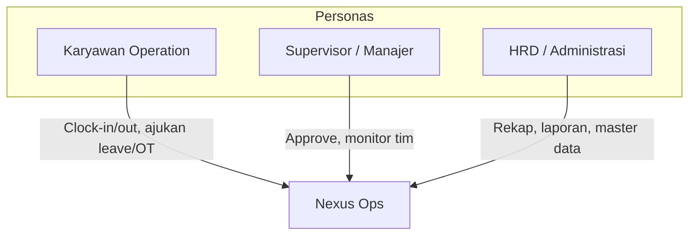
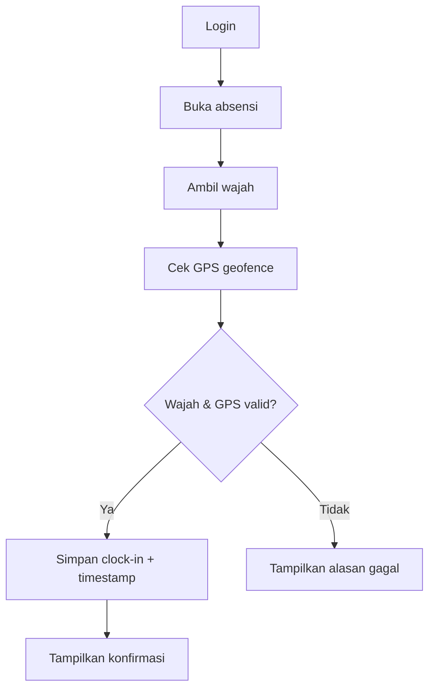
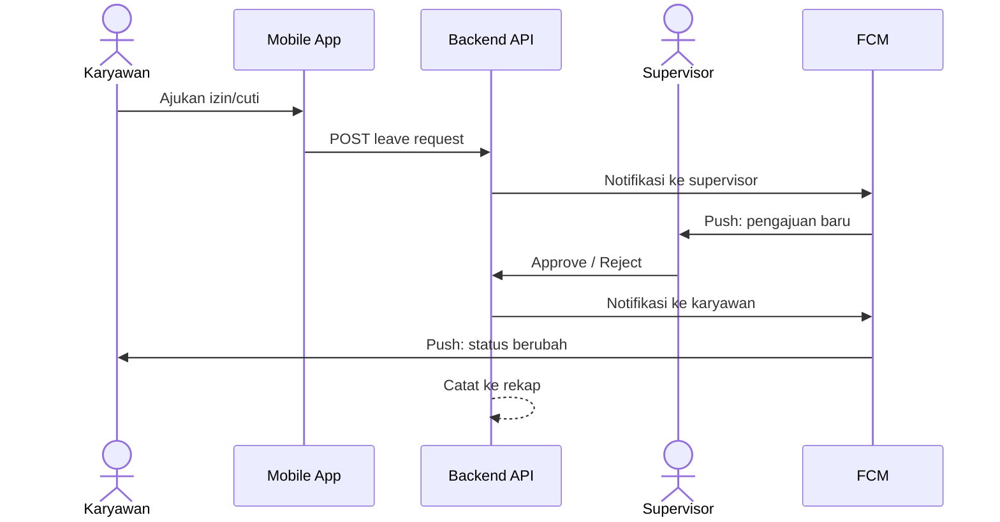
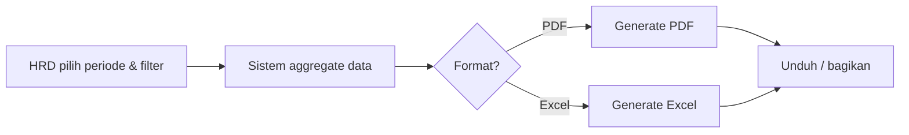
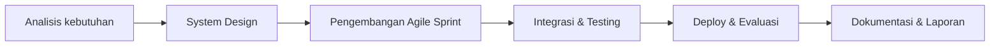

# Product Requirements Document (PRD)

:::info Status
**Draft** — disusun dari Proposal Capstone Project Kelompok B (STSI4440, 2026). Konten akan diperbarui setelah analisis kebutuhan dan wawancara pengguna selesai.
:::

| Field | Value |
|-------|-------|
| Product | Nexus Ops — Aplikasi Absensi Divisi Operation |
| Version | 0.1.3 (Draft) |
| Mata Kuliah | STSI4440 |
| Tim | Kelompok B — Capstone Project 50 Team B 2026 |
| Last updated | 2026-09-24 |

---

## 1. Ringkasan produk

Nexus Ops adalah sistem absensi digital untuk **Divisi Operation** yang mencatat kehadiran secara real-time dengan validasi identitas (face recognition) dan lokasi (GPS geofencing), serta mengintegrasikan pengelolaan izin/cuti, lembur, dashboard monitoring, dan laporan otomatis.

### Masalah yang diselesaikan

- Pencatatan absensi manual (kertas / spreadsheet) rentan error, manipulasi, dan terlambat dilaporkan.
- Lokasi kerja tersebar, sistem shift, serta izin/cuti yang dinamis sulit dipantau secara real-time.
- Manajemen kesulitan memperoleh data kehadiran yang akurat untuk payroll, evaluasi kinerja, dan disiplin kerja.

### Value proposition

Satu platform absensi yang akurat, aman, dan terpantau secara real-time — dari clock-in karyawan hingga laporan untuk manajemen dan HRD.

---

## 2. Latar belakang & tujuan

### Tujuan bisnis

1. Mencatat dan memantau kehadiran karyawan Divisi Operation secara digital dan real-time.
2. Meningkatkan akurasi & keamanan data melalui face recognition dan GPS geofencing.
3. Mengintegrasikan izin, cuti, dan lembur dalam satu platform.
4. Menyediakan dashboard interaktif dan pelaporan otomatis bagi manajemen.

### Tujuan keberhasilan (draft success metrics)

| Metrik | Target draft | Catatan |
|--------|--------------|---------|
| Accuracy clock-in valid | ≥ 95% kehadiran tervalidasi wajah + GPS | Diukur pada UAT |
| Waktu rekap laporan | &lt; 5 menit generate PDF/Excel | Vs proses manual |
| Adoption UAT | ≥ 80% skenario utama lulus | Karyawan + supervisor + HRD |
| Latency notifikasi | &lt; 1 menit setelah event | Status izin/cuti, pengingat |

*Metrik final akan dikunci setelah wawancara pengguna (Minggu 1).*

---

## 3. Pengguna & persona

| Persona | Peran | Kebutuhan utama |
|---------|-------|-----------------|
| **Karyawan Operation** | Pengguna utama absensi | Clock-in/out cepat, ajukan izin/cuti/lembur, terima notifikasi |
| **Supervisor / Manajer** | Penyetuju & monitoring | Setujui/tolak pengajuan, pantau kehadiran tim real-time |
| **HRD / Administrasi** | Rekap & pelaporan | Rekap data, generate laporan payroll/audit, kelola master data |

---

## 4. Ruang lingkup

### In scope (MVP / semester ini)

1. **Absensi digital** — clock-in/clock-out + face recognition + GPS geofencing
2. **Izin & cuti** — pengajuan, persetujuan, pencatatan, notifikasi
3. **Lembur** — input & persetujuan terintegrasi data kehadiran
4. **Dashboard monitoring** — kehadiran harian, rekap mingguan/bulanan, statistik keterlambatan/ketidakhadiran
5. **Laporan otomatis** — ekspor PDF/Excel
6. **Notifikasi** — push notification (absensi, status approval, deadline)
7. **Platform** — mobile Android + web dashboard admin
8. **Backend API** — REST API untuk autentikasi, absensi, dan layanan validasi

### Out of scope / batasan

| Batasan | Keterangan |
|---------|------------|
| Scope organisasi | Khusus Divisi Operation (ekspansi divisi lain = fase berikutnya) |
| Face recognition | Pakai library siap pakai; tidak train model dari nol |
| Integrasi payroll | Hanya ekspor data; tidak sinkron langsung ke sistem payroll existing |
| Platform mobile | Fokus Android (iOS dapat dipertimbangkan kemudian) |
| Storage | Database lokal/cloud perusahaan sesuai keputusan infrastruktur |

---

## 5. User stories & requirements fungsional

Prioritas: **P0** = harus ada di MVP · **P1** = penting · **P2** = nice-to-have / fase lanjut

### 5.1 Autentikasi & akun

| ID | User story | Priority |
|----|------------|----------|
| AUTH-01 | Sebagai karyawan, saya dapat login agar mengakses fitur absensi. | P0 |
| AUTH-02 | Sebagai admin/HRD, saya dapat mengelola akun pengguna (aktif/nonaktif, role). | P0 |
| AUTH-03 | Sebagai sistem, saya menegakkan role-based access (Karyawan / Supervisor / HRD). | P0 |

### 5.2 Absensi (clock-in / clock-out)

| ID | User story | Priority |
|----|------------|----------|
| ATT-01 | Sebagai karyawan, saya dapat clock-in/out dari aplikasi mobile. | P0 |
| ATT-02 | Sebagai sistem, saya memvalidasi wajah karyawan sebelum menyimpan absensi. | P0 |
| ATT-03 | Sebagai sistem, saya memvalidasi lokasi berada dalam area geofence yang diizinkan. | P0 |
| ATT-04 | Sebagai karyawan, saya melihat status absensi hari ini (sudah/belum clock-in, jam masuk/keluar). | P0 |
| ATT-05 | Sebagai sistem, saya mencatat timestamp, lokasi, dan hasil validasi untuk audit. | P0 |
| ATT-06 | Sebagai supervisor, saya melihat daftar karyawan yang belum absen pada shift berjalan. | P1 |

### 5.3 Izin & cuti

| ID | User story | Priority |
|----|------------|----------|
| LV-01 | Sebagai karyawan, saya dapat mengajukan izin/cuti dengan tanggal, jenis, dan keterangan. | P0 |
| LV-02 | Sebagai supervisor, saya dapat menyetujui atau menolak pengajuan. | P0 |
| LV-03 | Sebagai karyawan, saya menerima notifikasi saat status pengajuan berubah. | P0 |
| LV-04 | Sebagai HRD, saya dapat melihat riwayat izin/cuti untuk rekap. | P1 |

### 5.4 Lembur

| ID | User story | Priority |
|----|------------|----------|
| OT-01 | Sebagai karyawan, saya dapat mengajukan jam lembur terkait kehadiran. | P0 |
| OT-02 | Sebagai supervisor, saya dapat menyetujui/menolak lembur. | P0 |
| OT-03 | Sebagai HRD, data lembur masuk ke laporan untuk keperluan payroll. | P1 |

### 5.5 Dashboard & laporan

| ID | User story | Priority |
|----|------------|----------|
| RPT-01 | Sebagai manajer, saya melihat dashboard kehadiran real-time (harian). | P0 |
| RPT-02 | Sebagai manajer/HRD, saya melihat rekap mingguan/bulanan & statistik keterlambatan. | P0 |
| RPT-03 | Sebagai HRD, saya dapat generate laporan PDF/Excel. | P0 |
| RPT-04 | Sebagai sistem, laporan dapat difilter per periode / karyawan / status. | P1 |

### 5.6 Notifikasi

| ID | User story | Priority |
|----|------------|----------|
| NTF-01 | Sebagai karyawan, saya menerima pengingat absensi (mis. mendekati jam shift). | P1 |
| NTF-02 | Sebagai karyawan/supervisor, saya menerima notifikasi status approval. | P0 |
| NTF-03 | Sebagai karyawan, saya mendapat pengingat deadline pengajuan bila relevan. | P2 |

---

## 6. Requirements non-fungsional (draft)

| Kategori | Requirement | Target draft |
|----------|-------------|--------------|
| **Keamanan** | Autentikasi token; data wajah & lokasi dilindungi; akses berbasis role | HTTPS, hashed credentials, least privilege |
| **Akurasi** | Validasi ganda (wajah + GPS) sebelum absensi diterima | Reject jika salah satu gagal |
| **Ketersediaan** | Layanan API tersedia selama jam operasional | Target uptime disepakati di infra doc |
| **Performa** | Respons API absensi | &lt; 3 detik pada kondisi normal (draft) |
| **Usabilitas** | Clock-in dapat diselesaikan dalam alur singkat di mobile | ≤ 3 langkah utama setelah buka app |
| **Auditability** | Setiap absensi & approval tercatat | Immutable log fields (who/when/result) |
| **Portabilitas data** | Ekspor laporan standar | PDF & Excel |

---

## 7. Alur proses utama (ringkas)

### Clock-in

### Pengajuan izin/cuti

### Generate laporan

### Metodologi pengerjaan

*Diagram detail tambahan (state machine absensi, ERD) akan dilengkapi pada fase System Design (Minggu 2).*

---

## 8. Asumsi & dependensi

### Asumsi

- Karyawan memiliki perangkat Android dengan kamera dan GPS.
- Area kerja memiliki batas geofence yang dapat didefinisikan.
- Template wajah karyawan tersedia / dapat di-enroll saat onboarding.
- Stakeholder Divisi Operation tersedia untuk wawancara & UAT.

### Dependensi

- **Backend (terkunci):** Bun + Hono + Drizzle + Neon PostgreSQL + Cloudflare Workers — lihat [Infrastructure](./infrastructure)
- **Web (terkunci):** Vue 3 + Vite + TypeScript + Orval → Cloudflare Pages
- **Mobile (terkunci):** React Native + Expo (SDK 57) + Expo Router + Orval → APK via GitHub Actions
- Library face recognition (mis. face-api.js / Python `face_recognition`) — *TBD*
- Geolocation API + konfigurasi geofencing (server-side)
- Firebase Cloud Messaging (atau setara) untuk push notification — *TBD*
- Cloud storage (Firebase / R2 / S3) untuk aset terkait absensi — *TBD*
- Infrastruktur deployment selengkapnya: [Infrastructure Document](./infrastructure)

---

## 9. Milestone & jadwal (dari proposal)

Sprint board = **1 minggu × 8** (S1…S8). Detail & Gantt: [SDLC §4](./sdlc).

| Sprint | Minggu | Fokus | Artefak terkait PRD |
|--------|--------|-------|---------------------|
| S1 | 1 | Analisis kebutuhan, wawancara, requirement | PRD v0.2 (setelah feedback) |
| S2 | 2 | Desain + **kickoff paralel** BE & UI | Spec teknis + wireframe; OpenAPI awal |
| S3–S5 | 3–5 | **Build paralel** BE + mobile + web (utamanya P0) | Increment API + UI demoable |
| S6 | 6 | Parallel lanjut + integrasi (P1) | Test report awal |
| S7 | 7 | Parallel polish (P2) + mulai UAT | UAT checklist berjalan |
| S8 | 8 | UAT selesai, deploy, evaluasi, laporan | Release + laporan |

Metodologi: Waterfall untuk kerangka tahapan, **Agile Scrum (sprint 1 minggu)**; **backend dan UI dikerjakan paralel** sejak S2 (bukan antrian BE → mobile → web).

---

## 10. Acceptance criteria (MVP)

MVP dianggap selesai bila:

1. Karyawan dapat clock-in/out dengan validasi wajah **dan** GPS pada Android.
2. Pengajuan izin/cuti/lembur dapat di-approve/reject supervisor dengan notifikasi.
3. Dashboard menampilkan kehadiran harian dan rekap periode.
4. HRD dapat mengunduh laporan PDF atau Excel.
5. Role access membatasi fitur sesuai persona.
6. UAT skenario utama (draft checklist) lulus sesuai target adoption.

---

## 11. Risiko & mitigasi (draft)

| Risiko | Dampak | Mitigasi |
|--------|--------|----------|
| Akurasi face recognition rendah di lapangan | Absensi gagal / false reject | Threshold tunable; fallback approval supervisor (P1) |
| GPS tidak akurat / indoor | Geofence gagal | Radius geofence cukup; logging reason code |
| Scope creep fitur payroll penuh | Telat delivery | Kunci batasan: hanya ekspor |
| Ketersediaan stakeholder UAT | Feedback terlambat | Jadwalkan UAT di Minggu 7 sejak awal |
| Integrasi FCM / storage | Notifikasi / upload gagal | Spike teknis di sprint awal backend |

---

## 12. Tim & RACI ringkas

| Anggota | Peran |
|---------|-------|
| Atin Mulyanto | Project Leader & Analyst — requirement, koordinasi |
| Akmal Syarifudin | Backend Developer & Infrastructure — API, DB, face recognition, geofencing, deployment, CI/CD |
| Leonardus Sunu Kristianto | Mobile Developer — Android, kamera, GPS, notifikasi |
| Asep Muhammad | UI/UX & Frontend — Figma, web dashboard admin |

---

## 13. Luaran terkait

- Aplikasi mobile absensi (Android)
- Web dashboard admin
- Backend RESTful API
- Dokumentasi teknis (arsitektur, API spec, panduan)
- Laporan proyek + presentasi/demo

---

## 14. Riwayat revisi

| Versi | Tanggal | Perubahan |
|-------|---------|-----------|
| 0.1.0 | 2026-09-22 | Draft awal dari proposal capstone Kelompok B |
| 0.1.1 | 2026-09-23 | Dependensi backend diselaraskan ke stack aktual (Infra v0.2) |
| 0.1.2 | 2026-09-24 | Milestone sprint 1 minggu; BE∥UI paralel sejak S2 |
| 0.1.3 | 2026-09-24 | Dependensi web (Vue/CF Pages) & mobile (RN+Expo) terkunci |

---

## Referensi

- Proposal Capstone Project — Pengembangan Aplikasi Absensi Divisi Operation (Kelompok B, 2026)
- [Infrastructure Document (Draft)](./infrastructure)
- [Design System](./design-system)
- [Screens & Pages](./screens)
- [Introduction](./)
