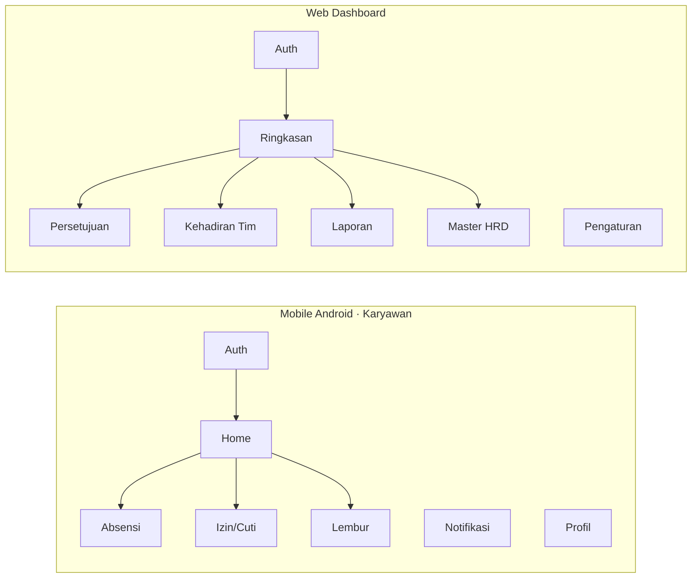

# Screens & Pages

:::info Status
**Draft v0.1.3** — inventaris layar Mobile (M-\*) dan Web (W-\*). Implementasi: **React Native + Expo** (mobile) · **Vue 3** (web). Rule domain: [PRD §10](./prd#10-keputusan-domain-terkunci-mvp). Visual token: [Design System](./design-system).
:::

| Field | Value |
|-------|-------|
| Product | Nexus Ops |
| Version | 0.1.3 |
| Mobile IDs | **M-\*** (karyawan Operation) — RN / Expo |
| Web IDs | **W-\*** (supervisor / HRD / admin) — Vue 3 |
| Last updated | 2026-09-24 |

---

## 1. Peta permukaan

---

## 2. Mobile — inventaris M-\*

### 2.1 Auth (`M-A*`)

| ID | Layar | Catatan |
|----|-------|---------|
| M-A01 | Splash & cek sesi | Brand mark + loading token |
| M-A02 | Masuk | Email/NIP + password (AUTH-01). **Tanpa** lupa password self-service |
| M-A03 | Sesi berakhir | Re-auth |

### 2.2 Home (`M-H*`)

| ID | Layar | Catatan |
|----|-------|---------|
| M-H01 | Beranda | Status hari ini, CTA clock, ringkas pengajuan |
| M-H02 | Detail shift | Jadwal dari **default shift org** + lokasi info |

### 2.3 Absensi (`M-ATT*`) — ATT-01…06

| ID | Layar | Catatan |
|----|-------|---------|
| M-ATT01 | Hub absensi | Clock-in **dan** clock-out entry (sama-sama face+GPS) |
| M-ATT02 | Capture wajah | Kamera + guide oval (ATT-02); retry maks 3 |
| M-ATT03 | Validasi lokasi | GPS + nama geofence; akurasi ≤ 50 m; radius default 100 m |
| M-ATT04 | Absensi berhasil | Timestamp + ringkas validasi (in atau out) |
| M-ATT05 | Gagal — wajah | Reason `FACE_MISMATCH` — **tanpa** override supervisor |
| M-ATT06 | Gagal — GPS | Reason `OUT_OF_GEOFENCE` / akurasi rendah |
| M-ATT07 | Riwayat absensi | List per periode |
| M-ATT08 | Detail catatan | Audit fields: waktu, lat/lng, hasil face/GPS |

### 2.4 Izin & cuti (`M-LV*`) — LV-01…03

| ID | Layar | Catatan |
|----|-------|---------|
| M-LV01 | Daftar pengajuan | Filter status |
| M-LV02 | Form ajukan | Jenis enum **Sakit / Cuti / Izin lain**, tanggal, keterangan. Pending: batal saja |
| M-LV03 | Detail pengajuan | Status + timeline approval (+ alasan tolak bila ada) |
| M-LV04 | Terkirim | Konfirmasi + notifikasi ke supervisor |

### 2.5 Lembur (`M-OT*`) — OT-01…02

| ID | Layar | Catatan |
|----|-------|---------|
| M-OT01 | Daftar lembur | |
| M-OT02 | Form lembur | Jam mulai/selesai; **maks 4 jam** |
| M-OT03 | Detail lembur | Status approval (+ alasan tolak bila ada) |

### 2.6 Notifikasi & profil (`M-N*` / `M-P*`)

| ID | Layar | Catatan |
|----|-------|---------|
| M-N01 | Pusat notifikasi | Approval, pengingat absensi (NTF-*) |
| M-N02 | Preferensi notifikasi | Quiet hours opsional |
| M-P01 | Profil saya | Nama, NIP, supervisor |
| M-P02 | Pengaturan | Bahasa, keamanan dasar |
| M-P03 | Enrollment wajah | **3 foto** → template embedding |
| M-P04 | Bantuan | Kontak HRD / FAQ singkat |

**Total mobile: 26 layar**

### 2.7 Tab bar

| Tab | Default screen |
|-----|----------------|
| Beranda | M-H01 |
| Absensi | M-ATT01 |
| Pengajuan | M-LV01 (segment: Izin \| Lembur) |
| Profil | M-P01 |

---

## 3. Web — inventaris W-\*

### 3.1 Auth & ringkasan

| ID | Halaman | Persona | Catatan |
|----|---------|---------|---------|
| W-A01 | Masuk dashboard | Semua | |
| W-D01 | Ringkasan operasional | Supervisor / HRD | Metrik harian (RPT-01) |
| W-D02 | Kehadiran live | Supervisor | Siapa sudah/belum absen (ATT-06) |

### 3.2 Persetujuan

| ID | Halaman | Persona | Catatan |
|----|---------|---------|---------|
| W-AP01 | Inbox persetujuan | Supervisor | Izin + lembur |
| W-AP02 | Detail izin/cuti | Supervisor | Approve / reject — **alasan wajib saat tolak** (LV-02) |
| W-AP03 | Detail lembur | Supervisor | Approve / reject — **alasan wajib saat tolak** (OT-02) |

### 3.3 Kehadiran & laporan

| ID | Halaman | Persona | Catatan |
|----|---------|---------|---------|
| W-T01 | Daftar kehadiran | Supervisor / HRD | Filter shift / status |
| W-T02 | Detail karyawan | Supervisor / HRD | Profil + riwayat singkat |
| W-R01 | Hub laporan | HRD / Manajer | RPT-02 |
| W-R02 | Filter laporan | HRD | Periode / karyawan / status (RPT-04) |
| W-R03 | Preview & unduh | HRD | **Excel wajib**; PDF nice-to-have (RPT-03) |

### 3.4 Master data HRD

| ID | Halaman | Persona | Catatan |
|----|---------|---------|---------|
| W-H01 | Manajemen pengguna | HRD | AUTH-02 |
| W-H02 | Form pengguna | HRD | email, nama, role, aktif, password awal; supervisor opsional |
| W-H03 | Lokasi & geofence | HRD | Master lokasi kerja (validasi absensi = salah satu lokasi aktif) |
| W-H04 | Form lokasi | HRD | Lat/lng + radius (default 100 m) |
| W-H05 | Log audit | HRD | Jejak approve / export |

### 3.5 Pengaturan

| ID | Halaman | Persona | Catatan |
|----|---------|---------|---------|
| W-S01 | Pengaturan organisasi | HRD | Default shift start, **grace 15 menit**, timezone |
| W-S02 | Notifikasi sistem | HRD | Template / channel FCM |

**Total web: 18 halaman**

---

## 4. Alur lintas layar (MVP)

### Clock-in / clock-out

`M-H01` → `M-ATT01` → `M-ATT02` → `M-ATT03` → `M-ATT04` | `M-ATT05` | `M-ATT06`

*(Mode in/out dipilih di `M-ATT01`; validasi wajah+GPS sama.)*

### Pengajuan izin

`M-LV01` → `M-LV02` → `M-LV04` → (push) `W-AP01` → `W-AP02` → (push) `M-N01` / `M-LV03`

### Laporan

`W-R01` → `W-R02` → `W-R03`

---

## 5. Prioritas implementasi UI

| Priority | IDs |
|----------|-----|
| P0 | M-A01–03, M-H01, M-ATT01–06, M-LV01–04, M-OT01–03, M-N01, M-P01, W-A01, W-D01–02, W-AP01–03, W-R01–03, W-H01–02 |
| P1 | M-ATT07–08, M-H02, M-P03, W-T01–02, W-H03–04 |
| P2 | M-N02, M-P02/04, W-H05, W-S01–02 |

Urutan kerja per layar/family (board Status): **[Contract]** + **[UI]** = Backlog → **[Impl]** + **[API]** (client wire) = Icebox sampai kontrak/UI siap. Sprint mapping: [SDLC §4](./sdlc).

---

## 6. Figma plugin

Plugin **Nexus Ops Design Generator** (`figma-plugin/`) menggambar:

- Board design tokens + metrik PRD
- Semua frame **M-\*** (phone 390)
- Semua frame **W-\*** (desktop 1280)

Lihat README plugin untuk build & load di Figma.

---

## 7. Riwayat revisi

| Versi | Tanggal | Perubahan |
|-------|---------|-----------|
| 0.1.0 | 2026-09-22 | Inventaris awal 26 mobile + 18 web dari proposal/PRD |
| 0.1.1 | 2026-09-24 | Prioritas P0 + M-A03/M-P01; urutan Status Contract/UI → Impl/API |
| 0.1.2 | 2026-09-24 | Catatan implementasi: RN+Expo (mobile), Vue 3 (web) |
| 0.1.3 | 2026-09-24 | Selaras PRD v0.2: clock-out, leave enum, reject reason, geofence 100m, Excel-first, W-H02 P0 |
