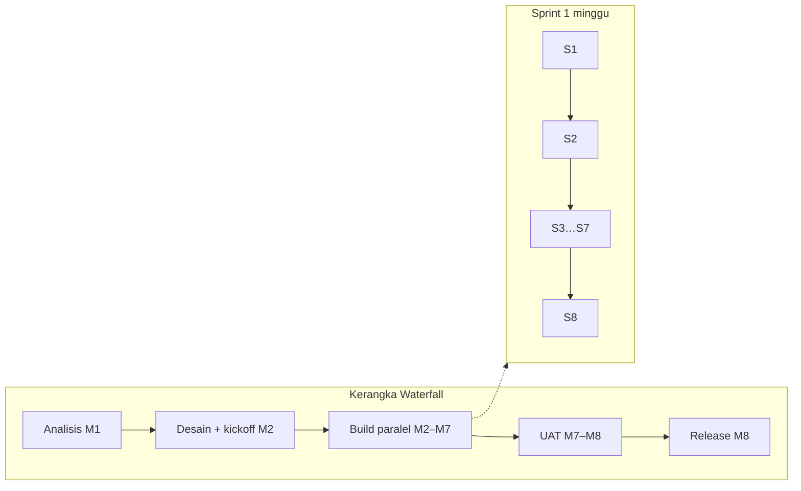
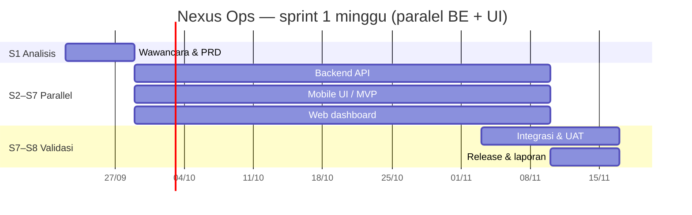
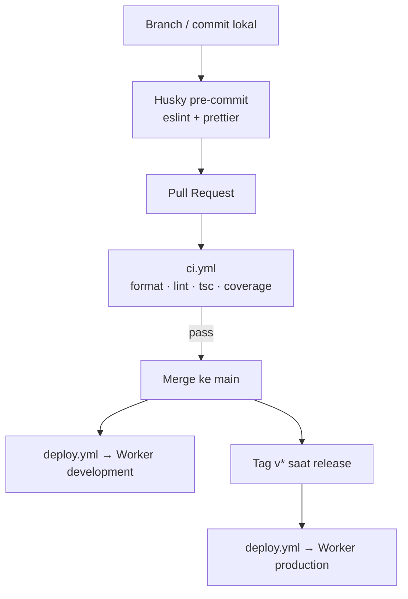

# Software Development Life Cycle (SDLC)

:::info Status
**Draft v0.1** — siklus hidup pengembangan Nexus Ops untuk Capstone Project 50 Team B 2026. Selaras dengan [PRD](./prd) (metodologi & milestone) dan [Infrastructure](./infrastructure) (CI/CD & lingkungan).
:::

| Field | Value |
|-------|-------|
| Product | Nexus Ops — Aplikasi Absensi Divisi Operation |
| Version | 0.1.5 (Draft) |
| Tim | Kelompok B — Capstone Project 50 Team B 2026 |
| Last updated | 2026-09-24 |

---

## 1. Tujuan dokumen

Dokumen ini mendefinisikan **cara tim bekerja** dari requirement hingga release: model proses, fase, artefak, gate kualitas, peran, dan alur delivery. Bukan pengganti PRD atau infra — melainkan kerangka operasional yang menghubungkan keduanya.

| Dokumen | Fokus |
|---------|--------|
| [PRD](./prd) | *Apa* yang dibangun (scope, user stories, acceptance) |
| **SDLC (dokumen ini)** | *Bagaimana* tim membangun & merilis |
| [Infrastructure](./infrastructure) | *Di mana* sistem berjalan (stack, env, CI/CD) |
| [Git Workflow](./git-workflow) | *Bagaimana* berkolaborasi di Git/GitHub sehari-hari |
| [Dev Setup](./dev-setup) | *Bagaimana* menyiapkan tool lokal |

---

## 2. Model proses

Nexus Ops memakai **hybrid**:

| Lapisan | Pendekatan | Alasan |
|---------|------------|--------|
| Kerangka proyek | **Waterfall** (fase berurutan 8 minggu) | Jadwal capstone tetap: analisis → desain → build → UAT → laporan |
| Fase pengembangan | **Agile Scrum** (sprint **1 minggu** × 8) | Ritme ketat; **backend + UI paralel** sejak Minggu 2 |

Prinsip kerja:

- Requirement dikunci bertahap (PRD draft → PRD setelah wawancara Minggu 1).
- **Paralel:** backend API, mobile UI, dan web UI dikerjakan bersamaan (Minggu 2–7), bukan antrian BE → mobile → web.
- Setiap sprint menghasilkan increment yang bisa di-demo (API dan/atau UI).
- Scope creep ditahan lewat Definition of Done + batasan MVP di PRD.
- Board GitHub Project: filter **This Sprint** = `sprint:@current -status:Icebox`; view **All** diurutkan by Sprint.
- **Otomasi:** workflow [`project-sprint-backlog.yml`](https://github.com/Capstone-Project-Team-B-2026/docs/blob/main/.github/workflows/project-sprint-backlog.yml) (cron harian + manual) mempromosikan item `[Contract]` / `[UI]` / `[Test]` yang sprint-nya sudah mulai dari **Icebox → Backlog**. `[Impl]` / `[API]` tetap Icebox sampai di-unblock. Secret repo docs: `PROJECT_TOKEN` (Projects write).

---

## 3. Fase SDLC

### 3.1 Analisis kebutuhan

| Item | Isi |
|------|-----|
| Aktivitas | Wawancara stakeholder Divisi Operation, clarifikasi persona, prioritas fitur |
| Input | Proposal capstone, brief mata kuliah |
| Output | [PRD](./prd) v0.2+, daftar asumsi & open questions |
| Gate | Scope MVP disepakati tim + dosen/pembimbing (jika applicable) |

### 3.2 Desain

| Item | Isi |
|------|-----|
| Aktivitas | Arsitektur sistem, skema DB, wireframe/UI, kontrak API |
| Output | [Infrastructure](./infrastructure), [Design System](./design-system), [Screens](./screens), OpenAPI (`/docs` backend) |
| Gate | Stack BE/web/mobile terkunci; **FCM + Cloudflare R2 terkunci**; face runtime spike di S3–S5 |

### 3.3 Implementasi (build)

| Item | Isi |
|------|-----|
| Aktivitas | Coding per modul (identity, absensi, leave, OT, reports), UI mobile & web |
| Repos | [backend](https://github.com/Capstone-Project-Team-B-2026/backend) · [web](https://github.com/Capstone-Project-Team-B-2026/web) · [mobile](https://github.com/Capstone-Project-Team-B-2026/mobile) |
| Praktik | Trunk-based (`main`), PR kecil, review peer, pre-commit Husky |
| Gate | CI hijau (format, lint, typecheck, coverage) sebelum merge |

### 3.4 Testing

| Lapisan | Cakupan | Catatan |
|---------|---------|---------|
| Unit / service | Domain & use case backend | Threshold coverage backend **≥ 95%** di CI |
| Kontrak API | OpenAPI + handler Zod | Regresi kontrak via test + `/docs` |
| Integrasi | Modul + Neon (dev) | Setelah API absensi / leave / OT siap |
| E2E / manual | Alur clock-in, approval, laporan | Checklist sebelum UAT |
| UAT | Skenario persona di lapangan / simulasi | Target adoption ≥ 80% skenario utama (PRD) |

### 3.5 Deployment & release

Alur backend (aktual) — detail di [Infrastructure §7](./infrastructure):

| Trigger | Lingkungan | Artefak |
|---------|------------|---------|
| Push `main` | Cloudflare Worker **development** | Preview / integrasi |
| Tag `v*` (mis. `v0.1.0`) | Cloudflare Worker **production** | Demo / operasional |

Mobile & web: build CI + distribusi internal; store track mengikuti kesiapan MVP.

### 3.6 Maintenance & evaluasi

| Aktivitas | Kapan |
|-----------|--------|
| Bugfix dari UAT | Minggu 7–8 |
| Hardening Worker / secret / observabilitas | Sprint akhir |
| Laporan akhir + presentasi/demo | Minggu 8 |
| Post-mortem singkat (apa yang jalan / tidak) | Setelah demo |

---

## 4. Jadwal & mapping fase ↔ sprint (1 minggu)

Diselaraskan dengan milestone PRD. **Satu minggu = satu sprint** di GitHub Project (`Sprint` field).

| Sprint | Tanggal (dari) | Fase | Fokus (paralel di M2–M7) | Artefak |
|--------|----------------|------|--------------------------|---------|
| **S1** | 2026-09-22 | Analisis | Wawancara, requirement | PRD v0.2 |
| **S2** | 2026-09-29 | Kickoff paralel | Auth/shell mobile + web; kontrak API | Login/home/dashboard skeleton |
| **S3** | 2026-10-06 | Build paralel | Attendance (face/GPS) + Approvals | Clock-in + inbox approve |
| **S4** | 2026-10-13 | Build paralel | Leave/OT + Reports | Pengajuan + ekspor |
| **S5** | 2026-10-20 | Build paralel | Profile/notif + HRD users | Enrollment + kelola akun |
| **S6** | 2026-10-27 | Build + integrasi | Riwayat/history + geofence master | P1 lists & lokasi |
| **S7** | 2026-11-03 | Polish + UAT start | Settings/P2 + mulai UAT | UAT checklist berjalan |
| **S8** | 2026-11-10 | UAT & Release | Perbaikan UAT, deploy, laporan | Tag release + laporan akhir |

**Urutan layar (board):** bergantung alur Figma (auth → absensi → leave/OT → profil; web: auth → dashboard → approval → laporan → HRD). UI + API layar yang sama satu sprint. Urutan *jenis* kerja: **[Contract]** / **[UI]** (Backlog) dulu, lalu **[Impl]** / **[API]** client (Icebox sampai siap). Roadmap: [Project view Roadmap](https://github.com/orgs/Capstone-Project-Team-B-2026/projects/2/views/3) (`has:sprint -status:Done`; Group by **Group** untuk swimlane).

*Tanggal absolut mengikuti kickoff 2026-09-22; sesuaikan jika jadwal kelas bergeser.*

---

## 5. Scrum (sprint 1 minggu)

### 5.1 Ritme

| Event | Frekuensi | Tujuan |
|-------|-----------|--------|
| Sprint | **1 minggu** (S1…S8) | Increment terencana; BE ∥ mobile ∥ web |
| Sprint planning | Awal sprint | Ambil issue `sprint:@current` (bukan Icebox) |
| Daily sync | Singkat (async/sync) | Blocking & handoff backend ↔ mobile ↔ web |
| Sprint review | Akhir sprint | Demo ke tim / stakeholder jika tersedia |
| Retro | Akhir sprint | Perbaiki proses (bukan hanya kode) |

### 5.2 Definition of Ready (DoR)

Item backlog siap dikerjakan jika:

1. User story / AC jelas (atau merujuk PRD).
2. Dependensi teknis diketahui (API contract, env, desain layar).
3. Estimasi muat dalam sprint (atau dipecah).

### 5.3 Definition of Done (DoD)

Increment dianggap *done* jika:

1. Kode di `main` lewat CI (lint, typecheck, test).
2. Backend: coverage tidak di bawah ambang CI (**≥ 95%**).
3. Perubahan API tercermin di OpenAPI / handler schema.
4. Tidak ada secret di Git; env mengikuti [Infrastructure](./infrastructure).
5. Demoable pada env **development** (atau build lokal yang terdokumentasi).
6. Dokumentasi terkait (PRD / screens / infra) diperbarui bila perilaku berubah.

---

## 6. Alur kerja Git & quality gate

Panduan lengkap (naming branch, commit, PR, konflik, multi-repo): **[Git Workflow](./git-workflow)**. Setup tool: [Development Tools Setup](./dev-setup).

| Praktik | Aturan |
|---------|--------|
| Branching | Trunk-based; PR ke `main` |
| Review | Minimal 1 reviewer untuk perubahan non-trivial |
| Commit | Pesan fokus *mengapa*; satu concern per PR |
| Hotfix | Via PR kecil ke `main`; tag patch `v*` jika perlu ke prod |

---

## 7. Peran & tanggung jawab

| Anggota | GitHub | Peran | Tanggung jawab SDLC |
|---------|--------|-------|---------------------|
| Atin Mulyanto | `atmcorporation` | Project Leader & Analyst + **Manual Tester** | Backlog, requirement, koordinasi fase, card `[Test]`, sign-off UAT |
| Akmal Syarifudin | `akmalsyrf` | Backend & Infrastructure | API, DB, face/geofence server-side, CI/CD Workers |
| Leonardus Sunu Kristianto | `leokrist` | Mobile Developer | Auth/home, absensi (kamera + GPS), profil/enrollment |
| Asep Muhammad | `asepmuhamad1300-ctrl` | UI/UX & Web Frontend | Figma, design system, web dashboard (Vue 3) |
| Moch Riswan Lutfin Anfa | `anfariswan` | Mobile & Web Frontend | Leave/OT/notif mobile; geofence & halaman web pendukung |

:::note
`atmcorporation` (Atin) ≠ `anfariswan` (Anfa).
:::

RACI ringkas per fase:

| Fase | A (Accountable) | R (Responsible) |
|------|-----------------|-----------------|
| Analisis / PRD | Atin | Tim (input persona & teknis) |
| Desain UI | Asep | Atin (review AC) |
| Backend | Akmal | — |
| Mobile (absensi/auth) | Leonardus | Akmal (kontrak API) |
| Mobile (leave/OT/notif) | Anfa | Akmal (kontrak API) |
| Web | Asep (+ Anfa pada area yang di-assign) | Akmal (kontrak API) |
| Tes manual / UAT checklist | Atin | Seluruh tim (fix bug) |
| Release | Akmal (tag/deploy) | Atin (sign-off scope) |

---

## 8. Manajemen risiko proses

| Risiko proses | Mitigasi |
|---------------|----------|
| Requirement bergeser setelah Minggu 2 | Change kecil lewat backlog; perubahan besar butuh update PRD + persetujuan Leader |
| Sprint overload | Potong ke MVP; defer P1 (lihat PRD) |
| Blocking antar-repo | Kontrak OpenAPI dulu; mock di klien bila API belum siap |
| UAT terlambat | Slot Minggu 7 dijadwalkan sejak analisis |
| CI merah menumpuk | Larangan merge; fix dalam hari yang sama |

Risiko produk (akurasi wajah, GPS, dll.) tetap di [PRD §11](./prd).

---

## 9. Artefak per fase (checklist)

| Fase | Artefak wajib |
|------|----------------|
| Analisis | PRD, catatan wawancara |
| Desain | Infra, design system, screens, skema DB / migrasi |
| Build | Kode di repo, OpenAPI up-to-date, coverage CI |
| Testing | Laporan test / checklist E2E |
| UAT | Hasil skenario + keputusan pass/fail |
| Release | Tag `v*`, catatan rilis singkat, laporan akhir capstone |

---

## 10. Riwayat revisi

| Versi | Tanggal | Perubahan |
|-------|---------|-----------|
| 0.1.0 | 2026-09-23 | Draft awal SDLC hybrid Waterfall + Scrum, selaras PRD & infra backend |
| 0.1.1 | 2026-09-24 | Sprint 1 minggu × 8; build BE∥UI paralel S2–S7; board filter This Sprint |
| 0.1.2 | 2026-09-24 | Urutan Status board: Contract/UI (Backlog) → Impl/API (Icebox) |
| 0.1.2 | 2026-09-24 | Tautan ke Git Workflow & Dev Setup |
| 0.1.3 | 2026-09-24 | Gate desain: stack web/mobile terkunci (Vue Pages + RN Expo) |
| 0.1.4 | 2026-09-24 | Tim: Moch Riswan Lutfin Anfa; Atin = PL/Analyst + manual tester (`atmcorporation` ≠ `anfariswan`) |
| 0.1.5 | 2026-09-24 | FCM+R2 terkunci; automation Icebox→Backlog untuk Contract/UI/Test saat sprint mulai |

---

## Referensi

- [Product Requirements Document (PRD)](./prd)
- [Infrastructure Document](./infrastructure)
- [Design System](./design-system)
- [Screens & Pages](./screens)
- [Development Tools Setup](./dev-setup)
- [Git Workflow](./git-workflow)
- [Introduction](./)
- Proposal Capstone Project — Pengembangan Aplikasi Absensi Divisi Operation (Kelompok B, 2026)
