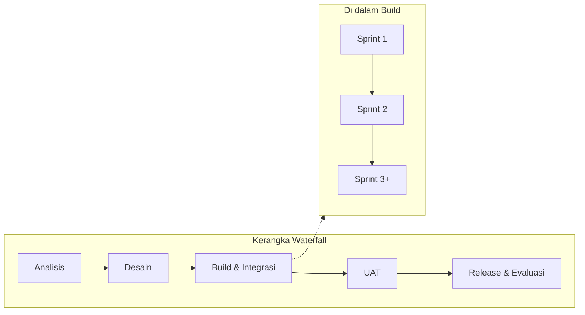
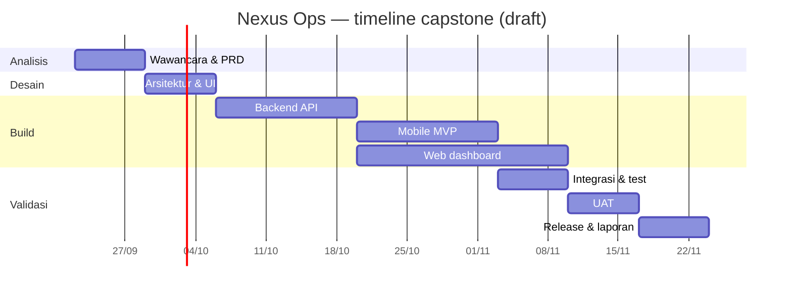
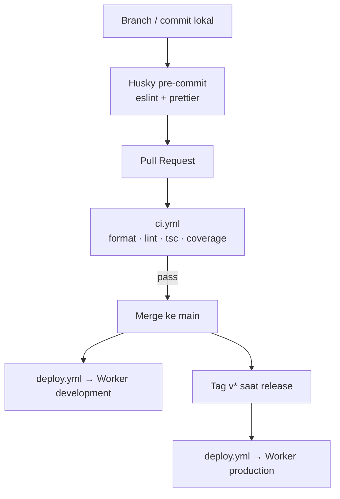

# Software Development Life Cycle (SDLC)

:::info Status
**Draft v0.1** — siklus hidup pengembangan Nexus Ops untuk Capstone Project 50 Team B 2026. Selaras dengan [PRD](./prd) (metodologi & milestone) dan [Infrastructure](./infrastructure) (CI/CD & lingkungan).
:::

| Field | Value |
|-------|-------|
| Product | Nexus Ops — Aplikasi Absensi Divisi Operation |
| Version | 0.1.0 (Draft) |
| Tim | Kelompok B — Capstone Project 50 Team B 2026 |
| Last updated | 2026-09-23 |

---

## 1. Tujuan dokumen

Dokumen ini mendefinisikan **cara tim bekerja** dari requirement hingga release: model proses, fase, artefak, gate kualitas, peran, dan alur delivery. Bukan pengganti PRD atau infra — melainkan kerangka operasional yang menghubungkan keduanya.

| Dokumen | Fokus |
|---------|--------|
| [PRD](./prd) | *Apa* yang dibangun (scope, user stories, acceptance) |
| **SDLC (dokumen ini)** | *Bagaimana* tim membangun & merilis |
| [Infrastructure](./infrastructure) | *Di mana* sistem berjalan (stack, env, CI/CD) |

---

## 2. Model proses

Nexus Ops memakai **hybrid**:

| Lapisan | Pendekatan | Alasan |
|---------|------------|--------|
| Kerangka proyek | **Waterfall** (fase berurutan 8 minggu) | Jadwal capstone tetap: analisis → desain → build → UAT → laporan |
| Fase pengembangan | **Agile Scrum** (sprint **2 minggu**) | Iterasi fitur, feedback cepat, prioritas backlog fleksibel |

Prinsip kerja:

- Requirement dikunci bertahap (PRD draft → PRD setelah wawancara Minggu 1).
- Setiap sprint menghasilkan increment yang bisa di-demo (API / mobile / web sesuai fokus sprint).
- Scope creep ditahan lewat Definition of Done + batasan MVP di PRD.

---

## 3. Fase SDLC

### 3.1 Analisis kebutuhan

| Item | Isi |
|------|-----|
| Aktivitas | Wawancara stakeholder Divisi Operation, clarifikasi persona, prioritas fitur |
| Input | Proposal capstone, brief mata kuliah |
| Output | [PRD](./prd) v0.2+, daftar asumsi & open questions |
| Gate | Scope MVP disepakati tim + dosen/pembimbing (jika applicable) |

### 3.2 Desain

| Item | Isi |
|------|-----|
| Aktivitas | Arsitektur sistem, skema DB, wireframe/UI, kontrak API |
| Output | [Infrastructure](./infrastructure), [Design System](./design-system), [Screens](./screens), OpenAPI (`/docs` backend) |
| Gate | Keputusan stack kritis terkunci (backend sudah); mobile/web/face/storage yang masih TBD dijadwalkan spike |

### 3.3 Implementasi (build)

| Item | Isi |
|------|-----|
| Aktivitas | Coding per modul (identity, absensi, leave, OT, reports), UI mobile & web |
| Repos | [backend](https://github.com/Capstone-Project-Team-B-2026/backend) · [web](https://github.com/Capstone-Project-Team-B-2026/web) · [mobile](https://github.com/Capstone-Project-Team-B-2026/mobile) |
| Praktik | Trunk-based (`main`), PR kecil, review peer, pre-commit Husky |
| Gate | CI hijau (format, lint, typecheck, coverage) sebelum merge |

### 3.4 Testing

| Lapisan | Cakupan | Catatan |
|---------|---------|---------|
| Unit / service | Domain & use case backend | Threshold coverage backend **≥ 95%** di CI |
| Kontrak API | OpenAPI + handler Zod | Regresi kontrak via test + `/docs` |
| Integrasi | Modul + Neon (dev) | Setelah API absensi / leave / OT siap |
| E2E / manual | Alur clock-in, approval, laporan | Checklist sebelum UAT |
| UAT | Skenario persona di lapangan / simulasi | Target adoption ≥ 80% skenario utama (PRD) |

### 3.5 Deployment & release

Alur backend (aktual) — detail di [Infrastructure §7](./infrastructure):

| Trigger | Lingkungan | Artefak |
|---------|------------|---------|
| Push `main` | Cloudflare Worker **development** | Preview / integrasi |
| Tag `v*` (mis. `v0.1.0`) | Cloudflare Worker **production** | Demo / operasional |

Mobile & web: build CI + distribusi internal; store track mengikuti kesiapan MVP.

### 3.6 Maintenance & evaluasi

| Aktivitas | Kapan |
|-----------|--------|
| Bugfix dari UAT | Minggu 7–8 |
| Hardening Worker / secret / observabilitas | Sprint akhir |
| Laporan akhir + presentasi/demo | Minggu 8 |
| Post-mortem singkat (apa yang jalan / tidak) | Setelah demo |

---

## 4. Jadwal & mapping fase ↔ minggu

Diselaraskan dengan milestone PRD:

| Minggu | Fase SDLC | Fokus | Artefak |
|--------|-----------|-------|---------|
| 1 | Analisis | Wawancara, requirement | PRD v0.2 |
| 2 | Desain | Arsitektur, DB, Figma | Infra + wireframe + screens |
| 3–4 | Build (Sprint) | Backend API + face + geofencing | ATT/LV API |
| 4–5 | Build (Sprint) | Mobile clock-in/out, leave, OT | APK Android MVP |
| 5–6 | Build (Sprint) | Web dashboard + laporan | Dashboard + export |
| 6 | Testing | Integrasi end-to-end | Test report |
| 7 | UAT | Validasi Divisi Operation | UAT sign-off |
| 8 | Release & evaluasi | Perbaikan, deploy, laporan | Tag release + laporan akhir |

*Tanggal absolut di Gantt bersifat ilustratif; acuan utama adalah kolom **Minggu** di tabel di atas.*

---

## 5. Scrum dalam fase build

### 5.1 Ritme

| Event | Frekuensi | Tujuan |
|-------|-----------|--------|
| Sprint | 2 minggu | Increment terencana |
| Sprint planning | Awal sprint | Pilih backlog dari PRD / open issues |
| Daily sync | Singkat (async/sync) | Blocking & handoff backend ↔ mobile ↔ web |
| Sprint review | Akhir sprint | Demo ke tim / stakeholder jika tersedia |
| Retro | Akhir sprint | Perbaiki proses (bukan hanya kode) |

### 5.2 Definition of Ready (DoR)

Item backlog siap dikerjakan jika:

1. User story / AC jelas (atau merujuk PRD).
2. Dependensi teknis diketahui (API contract, env, desain layar).
3. Estimasi muat dalam sprint (atau dipecah).

### 5.3 Definition of Done (DoD)

Increment dianggap *done* jika:

1. Kode di `main` lewat CI (lint, typecheck, test).
2. Backend: coverage tidak di bawah ambang CI (**≥ 95%**).
3. Perubahan API tercermin di OpenAPI / handler schema.
4. Tidak ada secret di Git; env mengikuti [Infrastructure](./infrastructure).
5. Demoable pada env **development** (atau build lokal yang terdokumentasi).
6. Dokumentasi terkait (PRD / screens / infra) diperbarui bila perilaku berubah.

---

## 6. Alur kerja Git & quality gate

| Praktik | Aturan |
|---------|--------|
| Branching | Trunk-based; PR ke `main` |
| Review | Minimal 1 reviewer untuk perubahan non-trivial |
| Commit | Pesan fokus *mengapa*; satu concern per PR |
| Hotfix | Via PR kecil ke `main`; tag patch `v*` jika perlu ke prod |

---

## 7. Peran & tanggung jawab

| Anggota | Peran | Tanggung jawab SDLC |
|---------|-------|---------------------|
| Atin Mulyanto | Project Leader & Analyst | Backlog, requirement, koordinasi fase & UAT |
| Akmal Syarifudin | Backend & Infrastructure | API, DB, face/geofence server-side, CI/CD Workers |
| Leonardus Sunu Kristianto | Mobile Developer | Android, kamera, GPS, notifikasi klien |
| Asep Muhammad | UI/UX & Frontend | Figma, design system, web dashboard |

RACI ringkas per fase:

| Fase | A (Accountable) | R (Responsible) |
|------|-----------------|-----------------|
| Analisis / PRD | Atin | Tim (input persona & teknis) |
| Desain UI | Asep | Atin (review AC) |
| Backend | Akmal | — |
| Mobile | Leonardus | Akmal (kontrak API) |
| Web | Asep | Akmal (kontrak API) |
| UAT | Atin | Seluruh tim |
| Release | Akmal (tag/deploy) | Atin (sign-off scope) |

---

## 8. Manajemen risiko proses

| Risiko proses | Mitigasi |
|---------------|----------|
| Requirement bergeser setelah Minggu 2 | Change kecil lewat backlog; perubahan besar butuh update PRD + persetujuan Leader |
| Sprint overload | Potong ke MVP; defer P1 (lihat PRD) |
| Blocking antar-repo | Kontrak OpenAPI dulu; mock di klien bila API belum siap |
| UAT terlambat | Slot Minggu 7 dijadwalkan sejak analisis |
| CI merah menumpuk | Larangan merge; fix dalam hari yang sama |

Risiko produk (akurasi wajah, GPS, dll.) tetap di [PRD §11](./prd).

---

## 9. Artefak per fase (checklist)

| Fase | Artefak wajib |
|------|----------------|
| Analisis | PRD, catatan wawancara |
| Desain | Infra, design system, screens, skema DB / migrasi |
| Build | Kode di repo, OpenAPI up-to-date, coverage CI |
| Testing | Laporan test / checklist E2E |
| UAT | Hasil skenario + keputusan pass/fail |
| Release | Tag `v*`, catatan rilis singkat, laporan akhir capstone |

---

## 10. Riwayat revisi

| Versi | Tanggal | Perubahan |
|-------|---------|-----------|
| 0.1.0 | 2026-09-23 | Draft awal SDLC hybrid Waterfall + Scrum, selaras PRD & infra backend |

---

## Referensi

- [Product Requirements Document (PRD)](./prd)
- [Infrastructure Document](./infrastructure)
- [Design System](./design-system)
- [Screens & Pages](./screens)
- [Introduction](./)
- Proposal Capstone Project — Pengembangan Aplikasi Absensi Divisi Operation (Kelompok B, 2026)
