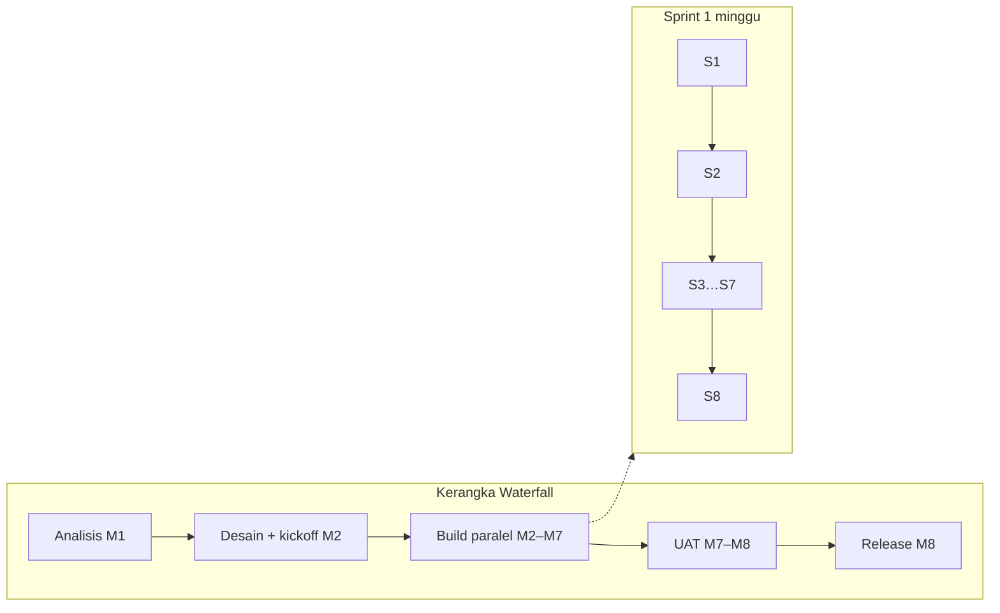
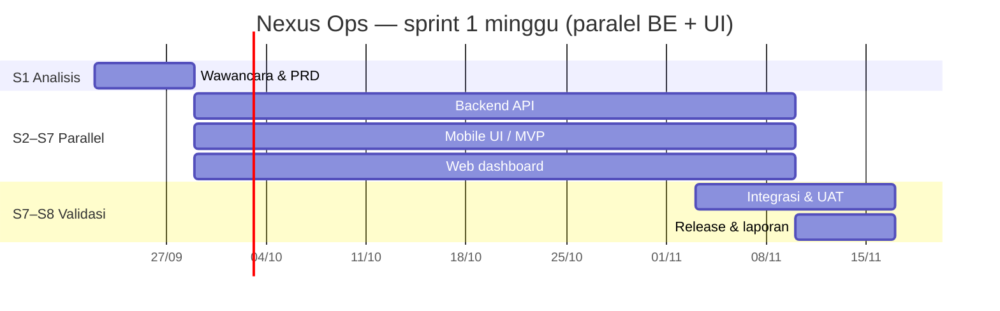
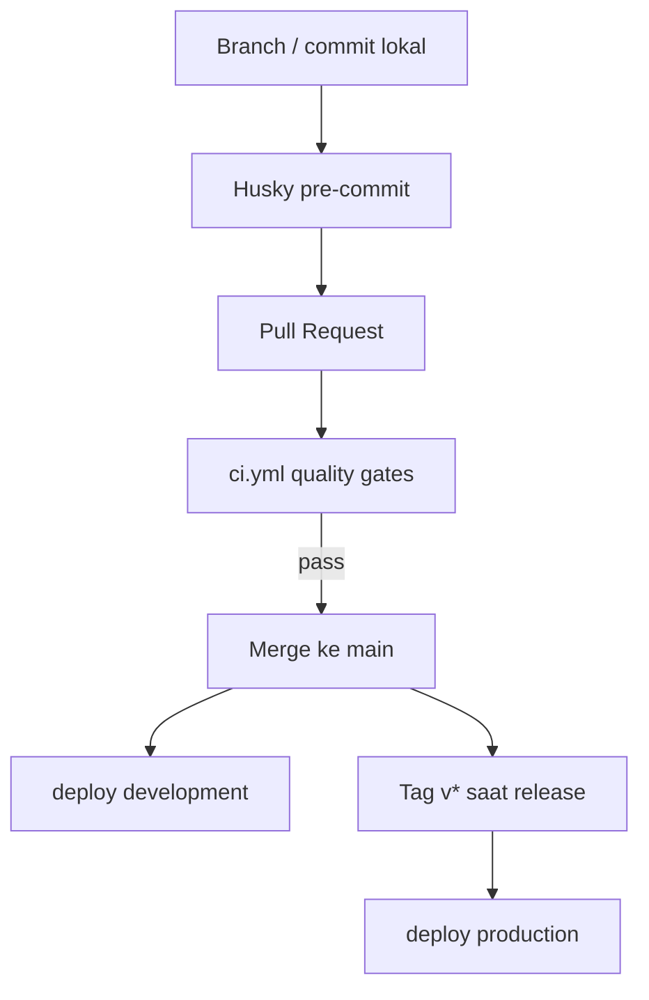

# Software Development Life Cycle (SDLC)

:::info Status
**Locked v1.0** — proses hybrid Waterfall + Scrum, DoR/DoD, testing, dan disiplin kontrak OpenAPI terkunci. Selaras [PRD](./prd) dan [Infrastructure](./infrastructure).
:::

| Field | Value |
|-------|-------|
| Product | Nexus Ops — Aplikasi Absensi Divisi Operation |
| Version | 1.0.0 |
| Tim | Kelompok B — Capstone Project 50 Team B 2026 |
| Last updated | 2026-09-24 |

---

## 1. Tujuan dokumen

Dokumen ini mendefinisikan **cara tim bekerja** dari requirement hingga release: model proses, fase, artefak, gate kualitas, peran, dan alur delivery.

| Dokumen | Fokus |
|---------|--------|
| [PRD](./prd) | *Apa* yang dibangun |
| **SDLC (dokumen ini)** | *Bagaimana* tim membangun & merilis |
| [Infrastructure](./infrastructure) | *Di mana* sistem berjalan |
| [Git Workflow](./git-workflow) | Kolaborasi Git/GitHub sehari-hari |
| [Dev Setup](./dev-setup) | Tool lokal |

---

## 2. Model proses

| Lapisan | Pendekatan | Alasan |
|---------|------------|--------|
| Kerangka proyek | **Waterfall** (fase berurutan 8 minggu) | Jadwal capstone tetap |
| Fase pengembangan | **Agile Scrum** (sprint **1 minggu** × 8) | **Backend + UI paralel** sejak Minggu 2 |

Prinsip kerja:

- Requirement dikunci (PRD Locked v1.0).
- **Paralel:** backend, mobile, web sejak S2.
- Setiap sprint menghasilkan increment demoable.
- Board: filter **This Sprint** = `sprint:@current -status:Icebox`.
- **Otomasi:** [`project-sprint-backlog.yml`](https://github.com/Capstone-Project-Team-B-2026/docs/blob/main/.github/workflows/project-sprint-backlog.yml) mempromosikan `[Contract]` / `[UI]` / `[Test]` yang sprint-nya sudah mulai: **Icebox → Backlog**, dan **menghapus label `Icebox`** agar Status field jadi sumber tunggal. Secret: `PROJECT_TOKEN`.

---

## 3. Fase SDLC

### 3.1 Analisis kebutuhan

| Item | Isi |
|------|-----|
| Output | [PRD](./prd) Locked v1.0 |
| Gate | Scope MVP + §10 domain locked |

### 3.2 Desain

| Item | Isi |
|------|-----|
| Output | [Infrastructure](./infrastructure) Locked, [Design System](./design-system), [Screens](./screens), OpenAPI |
| Gate | Stack + FCM + R2 + **face on-device** + ERD v1 terkunci |

### 3.3 Implementasi (build)

| Item | Isi |
|------|-----|
| Repos | backend · web · mobile |
| Praktik | Trunk-based, PR kecil, Husky |
| Gate | CI hijau sebelum merge |

### 3.4 Testing

| Lapisan | Cakupan | Catatan |
|---------|---------|---------|
| Unit / service | Domain & use case backend | Coverage **≥ 95%** (exclude handler/persistence per `bunfig.toml`) |
| Unit FE | `src/lib` + composable/hooks/store | Coverage **≥ 95%** pada path itu; komponen UI = component test terpisah (bukan gate 95% global) |
| Kontrak API | OpenAPI + Zod | **`info.version` bump** wajib; CI anti-drift di web/mobile |
| Integrasi BE | Modul + Postgres | Service `postgres` di CI · `drizzle-kit push` · seed · assert `app.request()` · script `test:integration` · job terpisah dari unit |
| E2E web | Playwright | Job CI: `playwright install --with-deps chromium`; **API di-mock** lewat `page.route` (suite default tanpa secret `E2E_*`; tag `@live` opsional) |
| E2E mobile | Maestro | **Gate manual** vs APK debug (owner Atin + assignee card); **bukan** CI — emulator terlalu lambat/flaky |
| Manual / UAT | Checklist `[Test]` | Owner Atin; target adoption ≥ 80% |

### 3.5 Deployment & release

| Trigger | Lingkungan |
|---------|------------|
| Push `main` | Worker / Pages **development** |
| Tag `v*` | Worker / Pages **production** · APK stg |

### 3.6 Maintenance & evaluasi

Bugfix UAT Minggu 7–8; laporan + presentasi Minggu 8.

---

## 4. Jadwal & mapping fase ↔ sprint (1 minggu)

| Sprint | Tanggal (dari) | Fase | Fokus | Artefak |
|--------|----------------|------|-------|---------|
| **S1** | 2026-09-22 | Analisis | Wawancara, requirement | PRD Locked |
| **S2** | 2026-09-29 | Kickoff paralel | Auth/shell mobile + web; kontrak API | Login/home/dashboard skeleton |
| **S3** | 2026-10-06 | Build paralel | Attendance (face/GPS) + Approvals + notif feed UI | Clock-in + inbox + M-N01 |
| **S4** | 2026-10-13 | Build paralel | Leave + Reports + riwayat UI + tim web | Leave + ekspor + history UI |
| **S5** | 2026-10-20 | Build paralel | OT + HRD users + notif API | Lembur + kelola akun + FCM |
| **S6** | 2026-10-27 | Build + integrasi | Geofence master + face enroll + history API | P1 lokasi & enrollment |
| **S7** | 2026-11-03 | Polish + UAT start | P2 sisa + mulai UAT | UAT checklist berjalan |
| **S8** | 2026-11-10 | UAT & Release | Perbaikan UAT, deploy, laporan | Tag `v1.0.0` + laporan akhir |

**Urutan jenis kerja:** **[Contract]** / **[UI]** / **[Test]** (Backlog) dulu → **[Impl]** / **[API]** (Icebox sampai siap).

---

## 5. Scrum (sprint 1 minggu)

### 5.1 Ritme

| Event | Frekuensi | Tujuan |
|-------|-----------|--------|
| Sprint | **1 minggu** (S1…S8) | Increment; BE ∥ mobile ∥ web |
| Sprint planning | Awal sprint | Ambil `sprint:@current` (bukan Icebox) |
| Daily sync | Singkat | Blocking & handoff |
| Sprint review | Akhir sprint | Demo |
| Retro | Akhir sprint | Proses |

### 5.2 Definition of Ready (DoR)

Item siap dikerjakan jika:

1. User story / AC jelas (atau merujuk PRD Locked).
2. Dependensi teknis diketahui.
3. Estimasi muat dalam sprint (field **Estimate** di board).
4. **`[UI]`:** frame Figma ada + daftar **testID** di [Design System §7](./design-system#7-registry-testid--data-testid) + nama token diketahui.
5. **`[Impl]` / `[API]`:** **`[Contract]`** sudah merge dengan `info.version` OpenAPI naik.

### 5.3 Definition of Done (DoD)

1. Kode di `main` lewat CI.
2. Backend: coverage unit ≥ 95%; integration hijau bila menyentuh modul terkait.
3. Perubahan API: OpenAPI `info.version` naik + publish ke `docs/static/openapi.json`.
4. Tidak ada secret di Git.
5. Demoable di **development**.
6. Docs terkait diperbarui bila perilaku berubah.
7. UI: `testID` / `data-testid` terpasang sesuai registry.

### 5.4 Disiplin kontrak OpenAPI

1. Backend generate `openapi.json`; bump **`info.version`** setiap perubahan path/schema.
2. Salin ke **`docs/static/openapi.json`** (URL publik Pages) + release asset.
3. Web/mobile CI: `npm run api:sync` lalu `git diff --exit-code openapi/ src/api/` — drift **gagal**.

### 5.5 Estimate di board

Field **Estimate** (story points / jam relatif) diisi untuk semua item agar bobot per sprint per orang terverifikasi di board, bukan hanya di chat. Assignee tidak diganti saat rebalance — hanya Sprint / Estimate.

---

## 6. Alur kerja Git & quality gate

Panduan: **[Git Workflow](./git-workflow)**. Setup: [Dev Setup](./dev-setup).

---

## 7. Peran & tanggung jawab

| Anggota | GitHub | Peran | Tanggung jawab SDLC |
|---------|--------|-------|---------------------|
| Atin Mulyanto | `atmcorporation` | Project Leader & Analyst + **Manual Tester** | Backlog, `[Test]`, UAT sign-off, Maestro gate |
| Akmal Syarifudin | `akmalsyrf` | Backend & Infrastructure | API, DB, face server-side, FCM/R2, CI/CD |
| Leonardus Sunu Kristianto | `leokrist` | Mobile Developer | Auth/home, absensi (kamera + GPS + face), profil/enrollment |
| Asep Muhammad | `asepmuhamad1300-ctrl` | UI/UX & Web Frontend | Figma, design system, web dashboard |
| Moch Riswan Lutfin Anfa | `anfariswan` | Mobile & Web Frontend | Leave/OT/notif mobile; geofence & web pendukung |

:::note
`atmcorporation` (Atin) ≠ `anfariswan` (Anfa).
:::

| Fase | A | R |
|------|---|---|
| Analisis / PRD | Atin | Tim |
| Desain UI | Asep | Atin (review AC) |
| Backend | Akmal | — |
| Mobile (absensi/auth) | Leonardus | Akmal (kontrak) |
| Mobile (leave/OT/notif) | Anfa | Akmal (kontrak) |
| Web | Asep (+ Anfa area assign) | Akmal (kontrak) |
| Tes manual / UAT | Atin | Seluruh tim (fix) |
| Release | Akmal (tag/deploy) | Atin (sign-off) |

---

## 8. Manajemen risiko proses

| Risiko proses | Mitigasi |
|---------------|----------|
| Requirement bergeser | Change kecil lewat backlog; besar = update PRD + Leader |
| Sprint overload | Potong MVP; defer P1 |
| Blocking antar-repo | Kontrak OpenAPI dulu; mock di klien |
| UAT terlambat | Slot Minggu 7 sejak analisis |
| CI merah menumpuk | Larangan merge; fix hari yang sama |
| Label Icebox ≠ Status | Automation hapus label Icebox saat promote |

Risiko produk: [PRD §12](./prd).

---

## 9. Artefak per fase (checklist)

| Fase | Artefak wajib |
|------|----------------|
| Analisis | PRD Locked |
| Desain | Infra Locked, design system, screens, ERD |
| Build | Kode, OpenAPI versioned, coverage CI |
| Testing | Integration BE · Playwright CI · Maestro manual · checklist Atin |
| UAT | Hasil skenario pass/fail |
| Release | Tag `v*`, catatan rilis, laporan akhir |

---

## 10. Riwayat revisi

| Versi | Tanggal | Perubahan |
|-------|---------|-----------|
| 0.1.0 | 2026-09-23 | Draft awal SDLC |
| 0.1.1–0.1.6 | 2026-09-24 | Sprint 1 minggu, paralel, FCM/R2, automation, rebalance |
| 1.0.0 | 2026-09-24 | **Locked:** DoR testID/contract, coverage scope, Playwright CI + Maestro manual, OpenAPI anti-drift, Estimate field |

---

## Referensi

- [Product Requirements Document (PRD)](./prd)
- [Infrastructure Document](./infrastructure)
- [Design System](./design-system)
- [Screens & Pages](./screens)
- [Development Tools Setup](./dev-setup)
- [Git Workflow](./git-workflow)
- [Introduction](./)
